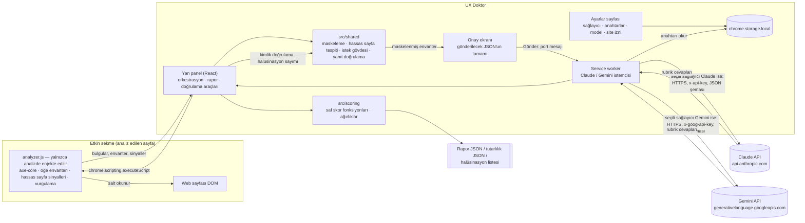

# UX Doktor

Açık web sayfasını analiz eden, UX eksikliklerini tespit edip skorlayan ve her bulguyu kanıtla gösteren Chrome
eklentisi (Manifest V3). İki katmanlıdır:

- **Deterministik katman:** axe-core ile WCAG 2.2 AA kontrolleri (kontrast, alt metin, form etiketi, 24×24 px
  dokunma hedefi, sayfa dili ve diğer AA ihlalleri).
- **Yorumsal katman:** Claude API ya da Google Gemini API (ücretsiz katman, Flash) ile Don Norman'ın 6 ilkesine göre
  evet/hayır rubriği. Sağlayıcı ayarlardan seçilir. LLM puan vermez; her cevap için kanıt öğe kimlikleri ve gerekçe
  döndürür, puanı kod hesaplar.

Kanıtı olmayan bulgu, bulgu sayılmaz: her bulgu benzersiz bir CSS seçiciye bağlıdır, sayfada vurgulanabilir ve
isteğe bağlı olarak kırpılmış ekran görüntüsüyle gösterilir.

Ödev metni: [docs/ODEV.md](docs/ODEV.md) · Gereksinim izlenebilirliği: [docs/GEREKSINIMLER.md](docs/GEREKSINIMLER.md)

---

## İçindekiler

1. [Kurulum](#kurulum)
2. [Kullanım](#kullanım)
3. [Mimari](#mimari)
4. [İzinler ve gerekçeleri](#izinler-ve-gerekçeleri)
5. [Deterministik katman](#deterministik-katman)
6. [Yorumsal (LLM) katman](#yorumsal-llm-katman)
7. [Gizlilik ve güvenlik](#gizlilik-ve-güvenlik)
8. [Skor formülü ve gerekçesi](#skor-formülü-ve-gerekçesi)
9. [Rapor biçimi](#rapor-biçimi)
10. [Doğrulama (Ödev Bölüm 4)](#doğrulama-ödev-bölüm-4)
11. [Bilinen sınırlamalar](#bilinen-sınırlamalar)
12. [Geliştirme](#geliştirme)
13. [Teslim kontrol listesi](#teslim-kontrol-listesi)

---

## Kurulum

Gereksinimler: Node.js **22.12 veya üstü** (Vitest 5 ve Vite 8 bu sürümü ister), Chrome **114 veya üstü**
(`chrome.sidePanel`), bir Claude API anahtarı **ya da** bir Gemini API anahtarı
([Google AI Studio → API key](https://aistudio.google.com/apikey); ücretsiz katman).

```bash
npm install
npm run build        # tsc -b + vite build → dist/ (ayrıca release/ altında zip)
```

Chrome'a yükleme:

1. `chrome://extensions` adresini açın, sağ üstten **Geliştirici modu**nu açın.
2. **Paketlenmemiş öğe yükle** → projenin `dist/` klasörünü seçin.
3. Araç çubuğundaki yapboz simgesinden **UX Doktor**'u sabitleyin.
4. Simgeye tıklayın: yan panel açılır. Panelde **Ayarlar** düğmesine basın.
5. Ayarlar sayfasında **LLM sağlayıcısı**nı seçin: Claude ya da Gemini.
6. Seçtiğiniz sağlayıcının anahtar kartına anahtarınızı girin, sonra **Kaydet** ve **Anahtarı doğrula** deyin.
   Doğrulama yalnızca model bilgisini sorgular, sayfa verisi göndermez.
7. Model seçin. Varsayılanlar: Claude için `claude-opus-5-5`, Gemini için `gemini-3.8-flash`.

Anahtarlar yalnızca bu tarayıcıda `chrome.storage.local` içinde, her sağlayıcı için ayrı alanda tutulur. Hiçbir
dosyaya yazılmaz, senkronize edilmez, loglanmaz.

> **Gemini ücretsiz katman uyarısı:** Google, ücretsiz katmanda gönderilen içeriği ve yanıtları ürünlerini ve makine
> öğrenmesi teknolojilerini geliştirmek için kullanabilir; insan incelemeciler girdi ve çıktıları okuyabilir.
> Ayrıntı: [Gizlilik ve güvenlik](#gizlilik-ve-güvenlik).

## Kullanım

1. Analiz etmek istediğiniz **herkese açık** sayfayı açın ve araç çubuğundaki UX Doktor simgesine **o sekmedeyken**
   tıklayın (bu, eklentiye yalnızca o sekme için geçici erişim verir).
2. **Bu sayfayı analiz et**: deterministik analiz ve hassas sayfa tespiti çalışır. Panelin düzeni:
   - en üstte iki ayrı skor kartı: **Deterministik** ve **LLM**; ağırlıklı toplam altında tek satır,
   - **En önemli 3 sorun**: şiddet sırasıyla, her kural bir kez; kural, seçici, tek cümle öneri ve **Sayfada göster**,
   - ayrıntılı bulgu grupları, kapalı açılır bölümler halinde ve başlıkta sayı rozetiyle.
3. Bulgularda **Sayfada göster** ile öğe vurgulanır; **Kanıt görüntüsü al** ile kırpılmış ekran görüntüsü bulguya
   eklenir. axe'in özgün (İngilizce) metni yalnızca **Teknik ayrıntı** bölümündedir.
4. **LLM analizi için gönderimi hazırla**: maskelenmiş öğe envanteri çıkarılır ve gönderilecek JSON'un tamamı onay
   ekranında gösterilir. **Gönder** demeden istek atılmaz.
5. **Raporu JSON olarak indir**: rapor tarayıcının indirme klasörüne iner (`reports/` klasörüne kopyalayın).
6. **Doğrulama araçları**: aynı sayfayı N kez analiz (N ≥ 3) ve halüsinasyon elle doğrulama listesi.

Simgeye tıklamadan panel zaten açıksa ve sayfaya erişim izni yoksa panel bunu söyler. İki seçenek vardır:
o sekmedeyken simgeye yeniden tıklamak ya da paneldeki **Site erişim izni ver** düğmesiyle isteğe bağlı izni vermek.
Verdiğiniz izni Ayarlar sayfasından geri alabilirsiniz.

---

## Mimari



| Klasör | İçerik |
|---|---|
| `src/background` | Service worker: yan panel davranışı, anahtar doğrulama, LLM çağrısı (`llmCall.ts`; Claude: `claudeClient.ts`, Gemini: `geminiClient.ts`) |
| `src/content` | Enjekte edilen analiz betiği: axe-core çalıştırma, seçici üretimi, envanter, hassas sayfa sinyalleri, vurgulama |
| `src/sidepanel` | Yan panel arayüzü, sekme köprüsü, LLM istemcisi, ekran görüntüsü, dışa aktarma |
| `src/options` | Ayarlar sayfası |
| `src/shared` | Rapor şeması (tek kaynak: `report.ts`), maskeleme, hassas sayfa tespiti, rubrik, istek gövdesi, yanıt doğrulama |
| `src/scoring` | Skor formülü (`score.ts`), ağırlıklar (`weights.ts`), tutarlılık istatistikleri (`stats.ts`) |
| `docs/` | Ödev metni, gereksinim tablosu, doğrulama şablonları |
| `reports/` | Gerçek çalıştırmaların JSON raporları |
| `scripts/` | Dışa aktarımlardan tablo ve oran üreten yardımcı betikler |

Analiz betiği manifest'te statik `content_scripts` olarak tanımlı değildir; yalnızca kullanıcı analiz başlattığında
`chrome.scripting.executeScript` ile enjekte edilir. CRXJS `?iife` importuyla tek parça derlenir ve
`web_accessible_resources` listesinden çıkarılır (`vite.config.ts`), böylece web sayfaları eklentinin varlığını bu
dosya üzerinden tespit edemez.

---

## İzinler ve gerekçeleri

| İzin | Neden gerekli | Kurulumda uyarı |
|---|---|---|
| `sidePanel` | Arayüz Chrome yan panelinde; simge tıklaması paneli açar (`setPanelBehavior`). | Hayır |
| `storage` | Sağlayıcı seçimi, API anahtarları ve model seçimi `chrome.storage.local` içinde. | Hayır |
| `activeTab` | Yalnızca kullanıcının simgeye tıkladığı sekmeye geçici erişim; sayfadan ayrılınca düşer. Ekran görüntüsü (`captureVisibleTab`) de bu izinle çalışır. | Hayır |
| `scripting` | Analiz betiğini yalnızca analiz istendiğinde enjekte etmek (`executeScript`). | Hayır |
| `host_permissions: https://api.anthropic.com/*` | Service worker'ın Claude API isteklerinin CORS nedeniyle engellenmemesi; yalnızca API alan adı. | Evet (yalnızca bu alan) |
| `host_permissions: https://generativelanguage.googleapis.com/*` | Service worker'ın Gemini API isteklerinin (`generateContent`, anahtar doğrulamada `models.get`) CORS nedeniyle engellenmemesi; yalnızca API alan adı, sayfa içeriğine erişim vermez. | Evet (yalnızca bu alan) |
| `optional_host_permissions: http://*/*, https://*/*` | **Kurulumda istenmez.** activeTab yetmezse (ör. panel açıkken başka sekmeye geçildiyse) kullanıcı paneldeki düğmeyle açıkça verir; Ayarlar'dan geri alınır. | İstendiği anda |

Bilerek kullanılmayanlar: statik `content_scripts`, `tabs`, `debugger`, `downloads` (indirme `<a download>` ile),
`contentSettings`.

Kaynaklar: [sidePanel](https://developer.chrome.com/docs/extensions/reference/api/sidePanel),
[activeTab](https://developer.chrome.com/docs/extensions/develop/concepts/activeTab),
[scripting](https://developer.chrome.com/docs/extensions/reference/api/scripting),
[captureVisibleTab](https://developer.chrome.com/docs/extensions/reference/api/tabs#method-captureVisibleTab),
[permissions](https://developer.chrome.com/docs/extensions/reference/api/permissions).

---

## Deterministik katman

axe-core 4.13.0, paketten gömülü olarak (uzak kod yok) `runOnly` etiketleri `wcag2a, wcag2aa, wcag21a, wcag21aa,
wcag22aa` ile çalışır. Kural adları paketteki `axe.getRules()` çıktısından doğrulanmıştır.

| Kategori | axe kuralları | WCAG |
|---|---|---|
| Renk kontrastı | `color-contrast` | 1.4.3 |
| Metin alternatifi | `image-alt`, `input-image-alt`, `role-img-alt`, `svg-img-alt`, `area-alt`, `object-alt` | 1.1.1 (area: 2.4.4, 4.1.2) |
| Form alanı etiketleri | `label`, `select-name`, `aria-input-field-name`, `aria-toggle-field-name` | 4.1.2 |
| Dokunma hedefi (24×24 px) | `target-size` — axe'de **varsayılan kapalıdır**, açıkça etkinleştirilir | 2.5.8 |
| Sayfa dili | `html-has-lang`, `html-lang-valid`, `valid-lang`, `html-xml-lang-mismatch` | 3.1.1, 3.1.2 |
| Diğer WCAG 2.2 AA ihlalleri | Etiket kümesindeki diğer tüm kurallar | kurala göre |

- Şiddet, axe'in `impact` değerinden eşlenir: critical → Kritik, serious → Yüksek, moderate → Orta, minor → Düşük.
- axe'in `incomplete` sonuçları ihlal sayılmaz ve skora girmez; **"Elle incelenmeli"** başlığıyla ayrı listelenir.
- Her bulgunun seçicisi `querySelectorAll` ile tekilliği doğrulanmış bir CSS seçicidir. Shadow DOM ve iframe
  içindeki öğeler bilgi amaçlı listelenir ama vurgulanamaz.
- **Türkçe, öğeye özel metinler:** [`src/shared/axeTemplates.ts`](src/shared/axeTemplates.ts) tek kaynaktır.
  - Kurulu axe-core 4.13.0'daki WCAG 2.2 AA etiketli **70 kuralın hepsinin** Türkçe başlığı vardır.
  - 45'ten fazla kural için öğeye özel şablon vardır. Şablonlar öğenin rolünü, etiketini, maskelenmiş adını ve ölçülen
    değerleri kullanır (kontrast oranı ve renkler, hedef boyutu, eksik ARIA rolleri/öznitelikleri). Örnek: `Akış
    (feed) "Duyurular" (<div>) içindeki doğrudan alt öğeleri gereken rolle işaretleyin (article; …)`.
  - Şablonu olmayan kurallarda Türkçe yedek metin kullanılır.
  - axe'in İngilizce metni yalnızca `technicalDetail` alanında kalır.
  - Birim testi, eklentinin çalıştırdığı her kural için önerinin boş olmadığını, Türkçe olduğunu ve axe'in İngilizce
    metnini içermediğini denetler.
- **Chrome çevirisi:** Çeviri, metinleri `<font style="vertical-align: inherit;">` sarmalayıcılarıyla değiştirir.
  Seçici üretimi `<font>` öğelerini yok sayar: hedef `<font>` ise en yakın anlamlı ataya çıkılır. Çeviri açıksa
  (`html.translated-ltr/rtl` ya da `<font>` sarmalayıcıları) panelde ve raporda (`page.translationDetected`) "seçiciler
  kararsız olabilir" notu çıkar. Bu ölçüt sezgiseldir; resmi bir Chrome dokümanı bulunamadı.

## Yorumsal (LLM) katman

**Girdi: numaralı öğe envanteri.** Sayfadaki landmark'lar, başlıklar, durum/canlı bölgeler, görünür etkileşimli
öğeler ve imleci "pointer" olan ama etkileşimli olmayan öğeler `E1, E2, …` kimlikleriyle listelenir. Her öğede şunlar
bulunur: rol, erişilebilir ad ya da görünür metin (maskelenmiş), etiket türü (`nameSource`), boyut ve konum,
görünürlük, ilk ekranda olup olmadığı, yazı boyutu, disabled/required/aria-* durumları, bağlantı hedef türü, temel
stiller ve benzersiz seçici. Sayfa özeti de eklenir: sayaçlar ile okunabilen stil dosyalarındaki `:focus`,
`:focus-visible` ve `:hover` kural sayıları. Envanter en çok **200 öğe** içerir; kesilirse rapora ve panele yazılır.
Ekran görüntüsü LLM'e gönderilmez.

**Rubrik:** 6 ilke × 4-5 soru = 29 evet/hayır sorusu (`src/shared/rubric.ts`). Her soru "evet = ilkeye uygun"
biçimindedir. "Hayır" cevabının şiddeti rubrikte sabittir; LLM belirlemez.

| İlke | Soru sayısı | Örnek |
|---|---|---|
| Görünürlük | 5 | Birincil eylem ilk ekranda görünür bir düğme/bağlantı mı? |
| Geri Bildirim | 5 | Durum mesajları için canlı bölge (aria-live/status/alert) var mı? |
| Kısıtlar | 4 | Giriş alanları uygun `type` ile sınırlandırılmış mı? |
| Eşleme | 5 | Form etiketleri alanla programatik olarak eşleşmiş mi? |
| Tutarlılık | 5 | Aynı işlevdeki öğeler tutarlı görünüm kullanıyor mu? |
| Sağlarlık | 5 | Tıklanabilir öğeler doğru öğe/rolle mi işaretlenmiş? |

**Çıktı:** her soru için `{questionId, answer: evet|hayir|belirsiz, evidenceIds, rationale, fix}`. Yanıt JSON
şemasına zorlanır: Claude'da `output_config.format`, Gemini'de `generationConfig.responseFormat.text.schema`. İki
sağlayıcıya aynı şema gider; şema yalnızca ikisinin de desteklediği anahtar sözcükleri kullanır. Yanıt istemcide
yeniden doğrulanır.

**Sağlayıcıdan bağımsız kısım:** iki sağlayıcıya da aynı sistem prompt'u ve aynı kullanıcı mesajı (rubrik +
maskelenmiş envanter) gider. Aynı onay ekranı, aynı kimlik doğrulaması ve aynı skor hesabı kullanılır. Her
çalıştırma kaydına sağlayıcı (`provider`), istenen/yanıtlayan model ve parametreler yazılır.

**Tutarlılığı artıran ayarlar** (sağlayıcıların resmi dokümantasyonuna göre):

| Model | Ayar |
|---|---|
| `claude-opus-5-5` (Claude varsayılanı) | `effort: "medium"` sabit. Bu model `temperature` kabul etmez (400 döner); düşünme her zaman açıktır. |
| `claude-sonnet-5-5` | `effort: "medium"` sabit; varsayılan dışı `temperature` 400 döner. |
| `claude-haiku-4-5` | `temperature: 0`; `effort` desteklenmez. |
| `gemini-3.8-flash` (Gemini varsayılanı) | `temperature: 1.0`, `thinkingConfig.thinkingLevel: "MEDIUM"` sabit. |
| `gemini-3.5-flash-lite` | Aynı ayarlar. |

**Gemini'de temperature neden 0 değil, 1.0?** Google, Gemini 3 modelleri için şunu yazıyor: *"For all Gemini 3
models, we strongly recommend keeping the temperature parameter at its default value of 1.0. Changing the temperature
(setting it below 1.0) may lead to unexpected behavior, such as looping or degraded performance, particularly in
complex mathematical or reasoning tasks."* ([Gemini 3 rehberi](https://ai.google.dev/gemini-api/docs/gemini-3)).
Bu yüzden önerilen değer açıkça gönderilir ve her çalıştırmaya yazılır. Tutarlılık başka yollarla sağlanır:
- düşünme düzeyi sabittir (`MEDIUM`; Flash'ta varsayılan `HIGH`, Claude tarafındaki `effort: "medium"` ile aynı düzey),
- rubrik kapalı uçludur,
- aynı gövde N kez gönderilir.

Sapma 10 puanı aşarsa `temperature: 0` ayrı bir deney olarak denenecek ve sonucu [Doğrulama](#a-tutarlılık-testi)
bölümüne yazılacaktır.

Bunlara ek olarak:
- Rubrik ve prompt sabittir ve sürümlüdür (`PROMPT_VERSION`, her çalıştırmaya yazılır).
- Tutarlılık testinde envanter bir kez çıkarılır ve aynı gövde N kez gönderilir.
- Claude'da `cache_control` ile tekrarlanan girdi önbellekten okunur; bu yalnızca maliyeti etkiler, çıktıyı
  etkilemez.

**İstek sınırı (tutarlılık testi):** Google ücretsiz katmanın sayısal sınırlarını dokümanda yayımlamıyor ("can be
viewed in Google AI Studio"). Bu yüzden temkinli bir kural uygulanır (`src/shared/retry.ts`, birim testli):
- Gemini çalıştırmaları arasında **15 sn** beklenir.
- **429** (`RESOURCE_EXHAUSTED`) ya da **503** hatasında aynı istek üstel beklemeyle en çok **4 kez** yeniden
  gönderilir: 2 s, 4 s, 8 s, 16 s, her birine 0-1 s rastgele sapma eklenir, üst sınır 60 s.
- Diğer hatalar (400, 403, 404) yeniden denenmez.
- Claude'da çalıştırmalar arası bekleme yoktur; 429 ve 529 (overloaded) için aynı yeniden deneme kuralı geçerlidir.
- Yeniden deneme sayısı çalıştırma kaydına (`retries`) ve tutarlılık dışa aktarımına (`pacing`) yazılır.
- Onay ekranı bu davranışı gönderimden önce açıkça yazar.

Kaynak: [Gemini sorun giderme — 429/503 için üstel bekleme](https://ai.google.dev/gemini-api/docs/troubleshooting),
[istek sınırları](https://ai.google.dev/gemini-api/docs/rate-limits).

**Ret yedeği:** Opus/Sonnet 5.5'te `fallbacks: "default"` (beta başlığı `server-side-fallback-2026-07-01`) gönderilir.
Model isteği güvenlik nedeniyle reddederse API isteği önerilen başka bir modelde çalıştırır. Hangi modelin yanıtladığı
(`servedModel`, `fallbackUsed`) her çalıştırma kaydına yazılır. Bu, tutarlılık ölçümünde model değişimini görünür
kılar.

**Yanıtın sağlamlığı** ([`src/shared/llmValidate.ts`](src/shared/llmValidate.ts), kurgusal yanıtlarla birim testli):
- ```json kod bloğu ve öndeki/sondaki açıklama metni temizlenir.
- Fazladan alanlar yok sayılır, eksik alanlar boş değer alır.
- Tek bir bozuk cevap atlanıp sayılır (`malformedAnswers`); tüm yanıtı düşürmez.
- Yanıt hiç uymuyorsa Türkçe "Model yanıtı beklenen şemaya uymadı; tekrar deneyin" hatası çıkar. Ham yanıt yine
  çalıştırma kaydında (tutarlılık testinde `failures[].rawResponse`) saklanır.
- LLM bulgusunun açıklaması envanter kimliği ve öğenin Türkçe tanımıyla başlar (ör. `E2 · düğme "Randevu al"
  (<button>) — …`). Öneri yoksa öğeye özel Türkçe yedek öneri yazılır. Türkçe olmayan model metni işaretlenir.

**Halüsinasyon kontrolü (otomatik):**
1. **Kimlik kontrolü:** envanterde olmayan bir kimliğe yapılan her atıf halüsinasyon sayılır, kanıttan düşülür ve
   sayılır. Geçerli kanıtı kalmayan "hayır" bulgu üretmez, skorda "belirsiz" sayılır. Sayfa düzeyindeki yokluklar
   (ör. hiç canlı bölge yok) için yalnızca `SAYFA` kimliği geçerlidir. Kimlik yalnızca boşluk ve büyük harf
   açısından normalleşir (`" e3"` → `E3`). `E3.` gibi biçimler halüsinasyon sayılmaya devam eder.
2. **Seçici kontrolü:** bulgu seçicileri sayfada yeniden aranır ve tek öğeyle eşleşip eşleşmediği raporlanır.

**Service worker çağrısı:** API çağrısı service worker'dan yapılır.
- **Claude:** resmi `@anthropic-ai/sdk`. `dangerouslyAllowBrowser: true` seçeneği tarayıcıdan doğrudan erişim için
  gereken `anthropic-dangerous-direct-browser-access: true` başlığını ekler.
- **Gemini:** `POST https://generativelanguage.googleapis.com/v1beta/models/{model}:generateContent`, ek paket
  olmadan `fetch` ile. Böylece onay ekranındaki gövde, gönderilen gövdenin birebir aynısı olur. Anahtar URL'ye değil
  `x-goog-api-key` başlığına konur; hata mesajlarında geçerse maskelenir.
  - Google yeni projelere Interactions API'yi öneriyor. Yine de `generateContent` seçildi: dokümanda *"remains fully
    supported"* yazıyor, durumsuz çalışıyor (Interactions isteği varsayılan olarak saklıyor) ve yanıt yapısı ayrıntılı
    belgelenmiş.
  - Yanıttan `finishReason` (`MAX_TOKENS`, `SAFETY` vb.), `promptFeedback.blockReason`, `modelVersion` (yanıtlayan
    model) ve `usageMetadata` alınır.
  - Kaynak: [generateContent API](https://ai.google.dev/api/generate-content),
    [yapılandırılmış çıktı](https://ai.google.dev/gemini-api/docs/generate-content/structured-output).
- **Otomatik tekrar kapalı:** SDK habersiz tekrar göndermez (`maxRetries: 0`). Yeniden deneme yalnızca tutarlılık
  testinde, yukarıdaki kurala göre ve onay ekranında açıklanarak yapılır.
- **Uyanık tutma:** yan panel port üzerinden 20 saniyede bir ping atar; uzun süren istek sırasında service worker
  uykuya geçmez.

---

## Gizlilik ve güvenlik

- **Hassas sayfa tespiti — üç durumlu karar** (`src/shared/sensitivity.ts`, birim ve tarayıcı testli):

  | Karar | Ne zaman | LLM gönderimi |
  |---|---|---|
  | **hassas** (`sensitive`) | En az bir güçlü sinyal | Kilitli; açık onayla açılır |
  | **belirsiz** (`uncertain`) | Yalnız zayıf sinyaller | Kilitli; açık onayla açılır (şüphede gönderilmez) |
  | **hassas değil** (`safe`) | Hiç sinyal yok | Açık (yine de her gönderimde onay ekranı) |

  - **Güçlü sinyaller:**
    - görünür şifre alanı,
    - görünür alanda `autocomplete="cc-*"`, `one-time-code`, `current-password`, `new-password`,
    - **görünür** hesap/oturum metinleri ("Hesabım", "Çıkış Yap", "Profilim", "Randevularım", …),
    - giriş/hesap/ödeme URL kalıpları ve kimlik doğrulamalı hizmetler (giris.turkiye.gov.tr, e-Nabız, MHRS),
    - bilinen özel uygulamalar: yapay zekâ sohbeti (claude.ai, chatgpt.com, gemini.google.com, …), e-posta,
      mesajlaşma, kişisel belge, internet bankacılığı.
  - **Zayıf sinyaller:**
    - yalnızca **görünmeyen** öğelerdeki hesap/oturum metni (kapalı menü, şablon),
    - görünmeyen şifre/kart alanı,
    - `<meta name="robots" content="noindex">`,
    - büyük düzenlenebilir yazma alanı (contenteditable / çok satırlı textbox; içeriği okunmaz; düz `<textarea>`
      sayılmaz, böylece iletişim formları tek başına alarm vermez),
    - `role="log"` bölgesi,
    - `/chat/…`, `/inbox` gibi yol kalıpları. `/c/…` e-ticaret kategori adreslerinde yaygın olduğu için bilerek
      listede yok.

  Görünürlük `Element.checkVisibility()` ile ölçülür. Görünmeyen öğenin `innerText` değeri `textContent`'e
  düştüğü için eski sürüm gizli menü metinlerini görünür sayıyordu. Karar, güçlü/zayıf gerekçeler, onay ve zamanı
  rapora (`privacy.level`, `strongReasons`, `weakReasons`, `consentGiven`, `consentAt`) yazılır.
- **Gönderim onayı:** her LLM gönderiminden önce onay ekranı açılır. Gönderilecek gövdenin tamamı gösterilir ve
  gönderilen gövdeyle birebir aynıdır (uçtan uca testte doğrulandı). Tutarlılık testinde onay ekranı N'yi açıkça yazar.
- **Maskeleme** (`src/shared/masking.ts`, birim testli): TC kimlik no (11 hane), telefon (TR ve uluslararası),
  e-posta, IBAN, kart numarası. Envanterdeki tüm metinler ve rapordaki HTML kanıt parçaları maskelenir.
- **Form değerleri okunmaz:** `input/textarea/select` öğelerinin `.value` değeri okunmaz; `value` attribute'u ve
  textarea/contenteditable içeriği alınmaz. `value` ile adlandırılmış düğmeler `nameSource:
  "value-attribute-hidden"` olarak işaretlenir. Rapordaki HTML parçalarında `value="[gizlendi]"` yazılır.
- **Salt okunur analiz:** tıklama, form gönderme, klavye simülasyonu yok; `chrome.debugger` kullanılmaz.
- **Vurgulama katmanı:** shadow DOM içinde, `pointer-events: none`; temizlenince tamamen kaldırılır. Analiz ve
  envanter öncesinde otomatik temizlenir, böylece sonucu etkilemez.
- **Uzak kod yok:** CDN betiği, `eval` ve uzaktan import kullanılmaz; axe-core paketten gömülüdür.
- **API anahtarları:** Claude ve Gemini anahtarları ayrı alanlarda tutulur. Koda gömülü değildir, repoya girmez,
  loglanmaz, panele gönderilmez. Service worker her çağrıda storage'dan okur.
- **Gemini ücretsiz katmanında veri kullanımı (etik):** Google'ın [Gemini API ek koşulları](https://ai.google.dev/gemini-api/terms)
  "Unpaid Services" için şunları söylüyor:
  - *"Google uses the content you submit to the Services and any generated responses to provide, improve, and develop
    Google products and services and machine learning technologies"* — yani gönderilen veri model eğitimi dahil ürün
    geliştirmede kullanılabilir. [Fiyatlandırma sayfası](https://ai.google.dev/gemini-api/docs/pricing) da ücretsiz
    katman için "Used to improve our products: Yes" yazar.
  - *"human reviewers may read, annotate, and process your API input and output"* — insanlar girdi ve çıktıları
    okuyabilir. Google bunu yapmadan önce verinin hesap, anahtar ve projeyle bağını kopardığını belirtiyor.
  - *"Do not submit sensitive, confidential, or personal information to the Unpaid Services."*

  Bu yüzden:
  - Gemini'ye de yalnızca maskelenmiş öğe envanteri gider (form değeri, ekran görüntüsü ya da tam HTML yok).
  - Gemini seçiliyse onay ekranında ve ayarlar sayfasında bu durum kısa bir uyarıyla gösterilir.
  - Hassas sayfa kilidi Gemini için de aynen geçerlidir.
  - Ödevde yalnızca herkese açık sayfalar analiz edilir. Kişisel veya sağlık verisi içeren sayfalarda Gemini ücretsiz
    katmanı kullanılmamalıdır.

---

## Skor formülü ve gerekçesi

Tüm ağırlıklar tek dosyadadır: [`src/scoring/weights.ts`](src/scoring/weights.ts). Formül:
[`src/scoring/score.ts`](src/scoring/score.ts) (birim testli). Sürüm: `skor-v2`.

**Şiddet ağırlıkları:** w(Kritik) = 4, w(Yüksek) = 3, w(Orta) = 2, w(Düşük) = 1.

**1. Deterministik skor (skor-v2: şiddet ağırlıklı doygunluk eğrisi)**

```
Kural cezası       p_r = w(şiddet_r) × (1 + log₂ n_r)          n_r: kuralı ihlal eden öğe sayısı
Kategori cezası    D_c = Σ p_r  (kategorideki ihlal edilen kurallar)
Kategori alt skoru S_c = 100 × e^(−D_c / k)
Toplam ceza        D   = Σ_c α_c × D_c ,   α_c = 6 × ağırlık_c  (ağırlıkların ortalaması 1)
Deterministik skor S   = 100 × e^(−D / k) ,   k = 25
```

Bir kuralın şiddeti, o kuralı ihlal eden öğelerin en yüksek şiddetidir. Kategoride hiç denetlenen öğe yoksa (geçen
yok, ihlal yok) kategori **uygulanamaz** (null) olur ve toplama katkı vermez. axe'in `incomplete` sonuçları kesin
olmadığı için skora girmez.

*Neden değişti (skor-v1 → skor-v2):* Eski formül `S_c = 100 × geçen / (geçen + Σ w)` idi ve kategori skorlarının
ağırlıklı **ortalaması** alınıyordu. samsun.edu.tr'de gözlenen durum: 5 Yüksek dokunma hedefi ihlali varken skor
99.0 çıktı. Bunun iki nedeni vardı:
1. Geçen öğe sayısı (büyük sayfada binlerce) ihlalleri eritiyordu; sayfa büyüdükçe skor şişiyordu.
2. İhlal yalnızca ağırlığı 0,10 olan bir kategorideyken, diğer kategoriler 100 olduğu için ortalama yine ~99'da
   kalıyordu.

*Değerlendirilen seçenekler:*

| Seçenek | S1: 5 Yüksek, tek kural | S1, 10 kat büyük sayfa | 3 Kritik + 2 Yüksek kural, çok öğe | Karar |
|---|---|---|---|---|
| A. Kural başına ceza + üst sınır: `100 − Σ min(2W, W(1+log₂n))` | 76 | 76 | 0 | Kötü sayfalar 0'a yığılır, birbirinden ayrılamaz |
| B. İhlalli öğe oranı | ~96 | ~99.6 | sayfaya bağlı | Sayfa büyüklüğüne bağlı kalır; asıl sorunu çözmez |
| **C. Doygunluk eğrisi (seçildi)** + ağırlıklı ceza toplamı | **78.7** | **78.7** | **~2** | 0-100 dışına çıkamaz; kötü sayfalar arasında da ayrım kalır |

Toplama yöntemi de karşılaştırıldı. C ile kategori ortalaması alınsaydı S1 için skor **96.7** olurdu, yani sorun
sürerdi. Ağırlıklı ceza toplamıyla **78.7** olur.

*k = 25 seçiminin gerekçesi:* k, "ne kadar ceza skoru yarıya indirir" sorusunun ayarıdır (D = k·ln2 ≈ 17,3'te
skor 50). Hedeflenen davranış:

| Durum | D | Skor |
|---|---|---|
| İhlal yok | 0 | 100 |
| Tek öğede tek Düşük ihlal | 1 | 96.1 |
| Tek öğede tek Kritik ihlal | 4 | 85.2 |
| Aynı Yüksek kuralda 5 öğe, kontrast kategorisinde (α = 1,5) | 14.9 | 55.0 |
| Aynı Yüksek kuralda 5 öğe, dokunma hedefinde (α = 0,6) — samsun örneği | 5.98 | 78.7 |
| D = k | 25 | 36.8 |
| 3 Kritik + 2 Yüksek kural, her biri 10-20 öğe | ~95 | ~2 |

k = 10 olsaydı tek bir Kritik ihlal skoru 67'ye indirirdi ve orta düzeyde sorunlu sayfalar hızla 0'a yığılırdı.
k = 50 olsaydı samsun örneği 88.7 çıkar, ihlaller yine görünmez kalırdı. 25, tek ve tekil bir sorunu "iyi ama
kusurlu" (80-95), birkaç kuralı "orta" (40-80), çok kurallı sayfaları "kötü" (<20) bölgeye yerleştiren değerdir.
Bu bir uzman yargısıdır; ampirik olarak kalibre edilmemiştir (bkz. Bilinen sınırlamalar).

*Örnek hesap (samsun.edu.tr gözlemi):*
1. `target-size` kuralında 5 öğe, şiddet Yüksek (w = 3) → p = 3 × (1 + log₂5) = 3 × 3,32 = 9,97.
2. Dokunma hedefi kategorisi: S_c = 100 × e^(−9,97/25) = **67.1**.
3. Toplam: α = 6 × 0,10 = 0,6 → D = 5,98 → S = 100 × e^(−5,98/25) = **78.7**.
4. Geçen öğe sayısı 10 ya da 1000 katına çıksa da skor 78.7 kalır.

*Diğer gerekçeler:*
- log₂ sönümleme: aynı hatanın 50 kopyası (ör. şablondaki tek bir eksik alt metin), 50 farklı hata kadar ağır
  sayılmaz. Ama 5 farklı kural, aynı kuralda 5 öğeden ağır basar (birim testli).
- Geçen öğe sayısı yalnızca kategorinin uygulanabilir olup olmadığını belirler; skora girmez.

**2. Norman ilke skoru** (her ilke p için, LLM cevaplarından **kod** hesaplar):

```
S_p = 100 × Σ w(evet) / (Σ w(evet) + Σ w(hayır))
```

w: sorunun rubrikteki şiddet ağırlığı. "Belirsiz" cevaplar skora girmez. Kanıtı geçersiz olduğu için belirsize
düşen "hayır"lar da girmez. İlkede hiç evet/hayır yoksa skor uygulanamaz olur.

*Gerekçe:* LLM'e puan verdirmek tekrarlanabilir değildir. Evet/hayır cevapları ve sabit şiddet ağırlıkları
kullanılınca skor denetlenebilir hale gelir: her puan farkı belirli bir sorunun cevabına kadar izlenebilir.
Statik analizle karar verilemeyen durumlar "belirsiz" olarak skoru yapay şekilde düşürmez.

**3. Katman skorları:**
- **LLM:** ilke alt skorlarının ağırlıklı ortalaması. Uygulanamayan ilkeler çıkarılır, kalan ağırlıklar yeniden
  ölçeklenir.
- **Deterministik:** ortalama değil, yukarıdaki ağırlıklı ceza toplamı. Kategori ağırlığı cezanın çarpanıdır
  (α_c = 6 × ağırlık).

| Deterministik kategori | Ağırlık | | Norman ilkesi | Ağırlık |
|---|---|---|---|---|
| Renk kontrastı | 0,25 | | Görünürlük | 1/6 |
| Metin alternatifi | 0,20 | | Geri Bildirim | 1/6 |
| Form alanı etiketleri | 0,20 | | Kısıtlar | 1/6 |
| Dokunma hedefi | 0,10 | | Eşleme | 1/6 |
| Sayfa dili | 0,10 | | Tutarlılık | 1/6 |
| Diğer WCAG AA | 0,15 | | Sağlarlık | 1/6 |

*Gerekçe:* Kontrast, alt metin ve form etiketleri hem en sık görülen hem de içeriğe erişimi doğrudan engelleyen
sorunlardır. Dil ve dokunma hedefi daha dar etkilidir. Diğer AA ihlalleri bir arada orta ağırlık alır. Ödevde Norman
ilkeleri arasında öncelik tanımlanmadığı için ilkeler eşit ağırlıklıdır.

**4. Toplam skor:**

```
Toplam = 0,6 × Deterministik + 0,4 × LLM        (LLM analizi yoksa Toplam = Deterministik)
```

*Gerekçe:* Deterministik ölçüm kesin ve tekrarlanabilirdir. LLM yorumu ise çalıştırmalar arasında değişebilir
(bkz. tutarlılık testi). Bu yüzden toplamda deterministik katman daha ağır basar. Deterministik ve LLM skorları
panelde ve raporda **ayrı** gösterilir.

---

## Rapor biçimi

Şemanın tek kaynağı [`src/shared/report.ts`](src/shared/report.ts) dosyasıdır (`schemaVersion: 1.2.0`).
- **1.1.0:** çalıştırma kaydına `provider`, `retries` ve `parameters.thinkingLevel` eklendi; `llmRequestPreview`
  `{provider, model, body}` biçimine geçti.
- **1.2.0:**
  - `Finding.technicalDetail` (axe'in İngilizce metni),
  - `page.translationDetected` / `translationReasons`,
  - `privacy.level` (`safe` | `uncertain` | `sensitive`), `strongReasons`, `weakReasons`,
  - `llm.malformedAnswers`, `llm.schemaError`,
  - `scores.deterministic.penalty` (skor-v2).

Raporun ana alanları:

| Alan | İçerik |
|---|---|
| `page` | Sayfanın kökeni + yolu (sorgu dizesi alınmaz), başlık, dil |
| `privacy` | Hassas sayfa sonucu, gerekçeler, açık onay ve zamanı |
| `deterministic` | axe sürümü, etiketler, bulgular, elle incelenmeli listesi, kategori başına geçen öğe sayıları |
| `llm` | Çalıştırma kaydı (sağlayıcı, ham yanıt, prompt sürümü, istenen/yanıtlayan model, parametreler, yeniden deneme sayısı, zaman, token), envanter kesilme bilgisi, rubrik cevapları, bulgular, halüsinasyon istatistikleri |
| `scores` | Deterministik ve LLM katman skorları (alt skorlar ve hesap ayrıntısıyla), toplam, ağırlıklar, formül sürümü |
| `llmRequestPreview` | LLM'e gönderilen istek: sağlayıcı, model ve gövde (gövde onay ekranındakiyle aynı; anahtar içermez) |

Her bulgu (`Finding`) şu alanları içerir:
- `selector`; LLM bulgularında ek olarak `elementId`,
- `source` (`deterministic` | `llm`),
- `rule` ("WCAG 1.4.3" ya da "Norman: Geri Bildirim"),
- `severity` (Kritik / Yüksek / Orta / Düşük),
- `description` ve `fix`,
- `evidence`: vurgulanabilirlik, maskelenmiş HTML ve isteğe bağlı ekran görüntüsü.

---

## Doğrulama (Ödev Bölüm 4)

> Bu bölümdeki **tüm değerler öğrencinin gerçek çalıştırmalarından** gelir. Araç verileri üretir (dışa aktarımlar ve
> `scripts/`), ancak sonuçları ve yorumları öğrenci yazar. Doldurulmamış alanlar `TODO: gerçek ölçüm` olarak
> bırakılmıştır.

### Test edilen siteler

| Kategori | Site ve sayfa (herkese açık) | Rapor | Deterministik | LLM | Toplam |
|---|---|---|---|---|---|
| Sağlık | TODO: gerçek ölçüm | `reports/saglik-…json` | TODO: gerçek ölçüm | TODO: gerçek ölçüm | TODO: gerçek ölçüm |
| Türk e-ticaret | TODO: gerçek ölçüm | `reports/eticaret-…json` | TODO: gerçek ölçüm | TODO: gerçek ölçüm | TODO: gerçek ölçüm |
| Kamu hizmeti | TODO: gerçek ölçüm | `reports/kamu-…json` | TODO: gerçek ölçüm | TODO: gerçek ölçüm | TODO: gerçek ölçüm |

### a) Tutarlılık testi

Yöntem:
- Yan panelde **Aynı sayfayı N kez analiz et** (N ≥ 3).
- Envanter bir kez çıkarılır, aynı istek gövdesi N kez gönderilir.
- Dışa aktarılan `reports/tutarlilik-<site>.json` dosyasından tablo `node scripts/tutarlilik-tablosu.mjs` ile üretilir.

| Alan | Değer |
|---|---|
| Sayfa | TODO: gerçek ölçüm |
| Sağlayıcı / model / prompt sürümü / N | TODO: gerçek ölçüm |
| temperature / thinkingLevel ya da effort (dışa aktarımdaki `parameters`) | TODO: gerçek ölçüm |
| Yeniden deneme sayısı (429/503) | TODO: gerçek ölçüm |
| İlke başına ortalama, std, min-max | TODO: gerçek ölçüm (betiğin ürettiği tabloyu buraya yapıştırın) |
| En büyük sapma (max − min) | TODO: gerçek ölçüm |
| Sapma 10 puanı aştı mı? | TODO: gerçek ölçüm |
| Aştıysa neden (cevabı değişen sorular: dışa aktarımdaki `questionAgreement`) | TODO: gerçek ölçüm |
| Çözüm ve çözüm sonrası ölçüm (Gemini'de gerekirse ayrı deney: `temperature: 0`) | TODO: gerçek ölçüm |

### b) Manuel karşılaştırma

Klavye ve ekran okuyucuyla en az bir görev: [docs/manuel-karsilastirma.md](docs/manuel-karsilastirma.md).

| Yakalanan | Kaçırılan | Yanlış alarm |
|---|---|---|
| TODO: gerçek ölçüm | TODO: gerçek ölçüm | TODO: gerçek ölçüm |

### c) Halüsinasyon kontrolü

Kontrol iki aşamalıdır:
1. **Otomatik:** kimlik envanterde mi, seçici sayfada mı. Sonuçlar raporun `llm.hallucination` alanındadır.
2. **Elle:** **Elle doğrulama listesini JSON olarak indir** ile her LLM bulgusu boş `gercekMi` alanıyla dışa
   aktarılır. Doldurduktan sonra oranı `node scripts/halusinasyon-orani.mjs reports/halusinasyon-*.json` hesaplar.

| Ölçü | Değer |
|---|---|
| Toplam LLM atfı / envanterde olmayan atıf (otomatik) | TODO: gerçek ölçüm |
| Elle doğrulanan bulgu sayısı | TODO: gerçek ölçüm |
| Var olmayan / yanlış öğeye işaret eden bulgu oranı | TODO: gerçek ölçüm |

### d) Büyükanne Testi ve Gece 3 Acil Durum Testi

Şablonlar: [docs/buyukanne-testi.md](docs/buyukanne-testi.md),
[docs/gece-3-acil-durum-testi.md](docs/gece-3-acil-durum-testi.md).

| Test | Aracın yakaladığı kritik sorun | Aracın kaçırdığı kritik sorun |
|---|---|---|
| Büyükanne Testi | TODO: gerçek ölçüm | TODO: gerçek ölçüm |
| Gece 3 Acil Durum Testi | TODO: gerçek ölçüm | TODO: gerçek ölçüm |

---

## Bilinen sınırlamalar

- **Statik analiz:** Sayfayla etkileşim yapılmaz (tıklama, yazma, odaklama yok). Bu yüzden **Geri Bildirim** ilkesi
  yalnızca statik ipuçlarından değerlendirilir:
  - aria-live/status/alert bölgeleri,
  - aria-invalid, aria-describedby,
  - yükleme göstergesi sayaçları,
  - okunabilen stil dosyalarındaki `:focus`, `:focus-visible` ve `:hover` kuralları.

  Gerçek hata mesajları, yükleme davranışı ve hover/focus görünümü doğrulanmaz. İpucu yoksa cevap "belirsiz" olur ve
  skora girmez.
- **Başka kökenden yüklenen stil dosyaları** (CDN) CORS nedeniyle okunamaz; odak/hover kural sayıları eksik kalabilir.
  Sayfa özetinde `unreadableSheets` olarak raporlanır.
- **iframe ve shadow DOM:** axe `iframes: false` ile çalışır. Shadow DOM içindeki öğeler envantere girmez. axe
  bulgularında listelenirler ama vurgulanamazlar.
- **Envanter sınırı:** en çok 200 öğe; çok büyük sayfalarda kesilir (rapora yazılır). LLM yalnızca gördüğü öğeler
  hakkında karar verir.
- **Dinamik sayfalar:** Analizden sonra DOM değişirse seçiciler eşleşmeyebilir. Seçici kontrolü bunu raporlar.
- **LLM değişkenliği:** Opus 5.5 ve Sonnet 5.5 `temperature` kabul etmez. Tutarlılık için effort sabitlenir ve rubrik
  kapalı uçludur, ancak çalıştırmalar arası fark tamamen sıfırlanamaz. Bu fark tutarlılık testiyle ölçülür.
  Sunucu taraflı yedek model devreye girerse (ret durumunda) yanıtı başka bir model üretir; kayıtta görünür.
- **Gemini'de temperature 1.0:** Google'ın önerisi nedeniyle temperature düşürülmez. Bu yüzden Gemini
  çalıştırmalarında örnekleme rastgeleliği Claude Haiku'daki `temperature: 0`'dan yüksek olabilir. Bu fark tutarlılık
  testiyle ölçülür; gerekirse `temperature: 0` ayrı deney olarak denenir (Google bu durumda döngü ve kalite düşüşü
  uyarısı veriyor).
- **Gemini ücretsiz katmanı ve veri:** Ücretsiz katmanda gönderilen içerik ve yanıtlar Google ürünlerini ve makine
  öğrenmesi teknolojilerini (model eğitimi dahil) geliştirmede kullanılabilir, insan incelemeciler tarafından
  okunabilir ([koşullar](https://ai.google.dev/gemini-api/terms)). Maskeleme kurallı (regex) çalıştığı için kişi adı
  gibi veriler maskelenmeyebilir. Bu nedenle Gemini yalnızca herkese açık sayfalarda kullanılmalıdır.
- **Gemini istek sınırları bilinmiyor:** Ücretsiz katman sınırları dokümanda sayı olarak yayımlanmıyor, projeye göre
  AI Studio'da görülüyor. 15 sn bekleme ve 4 yeniden deneme bir tahmindir; sınır daha sıkıysa tutarlılık testinde bazı
  çalıştırmalar başarısız olabilir. Başarısız çalıştırmalar dışa aktarımda `failures` alanına yazılır.
- **Gemini 401 UNAUTHENTICATED (çözülmedi, teşhis eklendi):** Öğrencinin denemesinde "Anahtarı doğrula" 401
  döndürdü. Google'a göre 28 Mayıs 2026'dan beri AI Studio'daki yeni anahtarlar servis hesabına bağlı "auth key"
  türündedir ([api-key](https://ai.google.dev/gemini-api/docs/api-key)). Bu anahtarların biçimi dokümanda yazmıyor.
  Sahte değerlerle yapılan denemede `x-goog-api-key` başlığındaki `AQ.` önekli bir değer, API anahtarı değil erişim
  belirteci gibi yorumlanıp **401 / ACCESS_TOKEN_TYPE_UNSUPPORTED** döndü. Rastgele bir değer ise 400 / API_KEY_INVALID
  döndü. Bu yalnızca bir hipotezdir. Panelin **Teşhis bilgisi** kutusu Google'ın `status`/`reason`/`message` alanlarını,
  uç nokta yolunu, modeli ve anahtarın yalnızca kaba biçim sınıfı ile uzunluğunu gösterir; nedeni bu bilgiyle
  kesinleştirin.
- **Gemini `mimeType`:** Yapılandırılmış çıktı rehberindeki REST örneği `"application/json"` yazıyor, ama sunucu bunu
  400 ile reddediyor. Doğru değer API referansındaki enum: `APPLICATION_JSON`. Gövde, anahtardan önce doğrulandığı için
  bu fark sahte anahtarla gözlendi ve düzeltildi.
- **Sayfa çevirisi:** Çeviri açıkken analiz edilen sayfanın DOM'u ve `lang` değeri değişir. Seçiciler `<font>`
  sarmalayıcılarını yok sayar, ama sonuçlar çevirisiz sayfayla birebir aynı olmayabilir. Tekrarlanabilirlik için
  çeviriyi kapatıp yeniden analiz edin.
- **Gemini `servedModel`:** Yanıtlayan model `modelVersion` alanından alınır. Bu alan, istenen model adından farklı
  bir sürüm adı içerebilir.
- **Maskeleme kurallı (regex) çalışır:**
  - Kişi adları ve serbest metindeki sağlık bilgisi maskelenmez.
  - Şüpheli uzun sayılar (13-19 hane) kart olarak maskelenebilir; bu bilinçli olarak fazla maskelemedir.
- **Hassas sayfa tespiti sezgiseldir.** Özel uygulama listesi hiçbir zaman tam değildir. Herkese açık bir sayfadaki
  görünür "Hesabım" bağlantısı, `noindex` ya da büyük bir yazma alanı yanlış alarm verebilir (kullanıcı onayıyla
  açılır).
- **Gerçek gözlemler (öğrencinin ilk denemeleri; ölçüm değil, nitel gözlem):**
  - **Yanlış alarm — learn.microsoft.com** (herkese açık belge sayfası): eski sürüm sayfayı **hassas** saydı.
    Gerekçe olarak "oturumu kapat" metni gösterildi. Olası neden: oturum açılmamış sayfadaki kapalı kullanıcı menüsü
    şablonu. Görünmeyen öğenin metni görünür sayılıyordu. Düzeltme: gizli metin artık yalnızca zayıf sinyal; karar en
    çok **belirsiz** olur. Anonim yeniden kurgu: `tests/fixtures/gizlilik-belge-sayfasi.html`.
  - **Kaçırılan hassas sayfa — claude.ai** (giriş yapılmış özel sohbet): eski sürüm "hassas işareti bulunmadı" dedi.
    Şifre alanı, hesap URL kalıbı ya da görünür çıkış metni yoktu. Ödevin etik bölümü açısından en riskli durum
    budur. Düzeltme: bilinen sohbet uygulamaları alan adı listesi (güçlü sinyal → **hassas**) ve uygulama kabuğu
    işaretleri (yazma alanı, `role="log"`, `noindex` → en az **belirsiz**). Anonim yeniden kurgu:
    `tests/fixtures/gizlilik-sohbet-uygulamasi.html`.
  - Fixture'lar gerçek sayfalardan kopyalanmadı. Yapıları gözleme dayanan varsayımlardır ve gerçek kişisel içerik
    içermezler. Gerçek sayfaların bugünkü davranışı elle yeniden denenmelidir.
- **Ekran görüntüsü** `activeTab` (ya da `<all_urls>`) ister. İsteğe bağlı http/https izni bunun yerine geçmez; bu
  durumda vurgulama kullanılabilir.
- **activeTab ve yan panel:** Resmi doküman, simgeye tıklanınca açılan yan panelin activeTab verip vermediğini
  belirtmiyor. Verilmezse panel bunu söyler ve isteğe bağlı site izni sunar.
- **Kural ağırlıkları** (şiddet, kategori ve katman ağırlıkları) ve doygunluk sabiti **k = 25** uzman yargısıdır; ampirik olarak kalibre edilmemiştir.

---

## Geliştirme

```bash
npm run build       # tip kontrolü + derleme (dist/)
npm run typecheck   # yalnızca tip kontrolü (tsc -b)
npm test            # Vitest birim testleri (Node)
npm run test:browser  # tarayıcı testleri (önce npm run build; yüklü Chrome gerekir)
npm run dev         # CRXJS geliştirme sunucusu (HMR)
```

Birim testleri (`src/**/*.test.ts`):
- maskeleme, hassas sayfa tespiti, axe eşlemesi,
- LLM istek gövdesi (Claude ve Gemini) ve yanıt doğrulama, Gemini yanıt ayrıştırma,
- 429/503 yeniden deneme kuralı, anahtar biçim denetimi,
- skor formülü, tutarlılık istatistikleri, rapor ve dışa aktarım kurucuları,
- Türkçe kural şablonları, öncelik sıralaması, çeviri tespiti, Gemini hata teşhisi, kurgusal bozuk LLM yanıtları.

Testlerde gerçek API anahtarı ve gerçek kişisel veri kullanılmaz.

**Tarayıcı testleri** (`tests/browser/`, `npm run test:browser`):
- Yeni bağımlılık yoktur. Yüklü Chrome başsız (`--headless=new`) açılır, Node'un yerleşik `WebSocket`'i ile Chrome
  DevTools Protokolü (CDP) üzerinden konuşulur.
- Yalnızca yerel fixture'lar (`tests/fixtures/`) yüklenir ve derlenmiş analiz betiği (`dist/src/content/analyzer.js`)
  enjekte edilir. Chrome yolu bulunamazsa `CHROME_PATH` ortam değişkeniyle verilir.
- CDP yalnızca bu test aracındadır; eklentinin kendisi `chrome.debugger` kullanmaz.
- Kapsam:
  - `selector.test.ts`: çeviri `<font>` sarmalayıcılarında seçiciler "font" içermez ve doğru öğeyi bulur,
  - `privacy.test.ts`: iki anonim gizlilik fixture'ında gerçek sinyal toplama,
  - `known-errors.test.ts`: `bilinen-hatalar.html` sayfasındaki kasıtlı 7 hatanın hepsi yakalanır, 5 kontrol öğesinde
    yanlış alarm yoktur. Liste: `tests/fixtures/beklenen.json`. Bu, Ödev 4.b için aracın kendi kendine sınamasıdır;
    manuel karşılaştırma tablosunun yerine geçmez.

Commit öncesi: `npm run build`, `npx tsc --noEmit -p tsconfig.app.json`, `npm test` ve `npm run test:browser` hatasız
geçmelidir. Kök
`tsconfig.json` yalnızca referans içerdiği için kökte `npx tsc --noEmit` hiçbir dosyayı denetlemez; bu yüzden `-p`
ile alt yapılandırma ya da `npm run typecheck` kullanın.

## Teslim kontrol listesi

| Teslim | Durum |
|---|---|
| GitHub repo (anlamlı commit geçmişi) | https://github.com/HakanKoco/UX-DOCTOR-CHROME (push: öğrenci) |
| README: kurulum, skor formülü, mimari şema, bilinen sınırlamalar | Bu dosya |
| README: doğrulama sonuçları | TODO: gerçek ölçüm (öğrenci) |
| 3 sitenin JSON raporu (`reports/`) | TODO: gerçek ölçüm (öğrenci) |
| 3-5 dakikalık demo videosu | TODO (öğrenci) — bağlantı: |
| Yansıtma notu (yarım sayfa) | TODO (öğrenci) |
