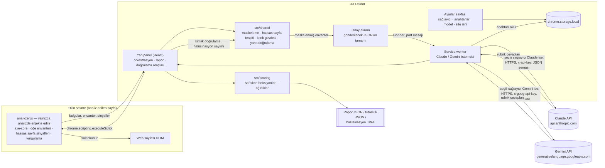

# UX Doktor

Açık web sayfasını analiz eden, UX eksikliklerini tespit edip skorlayan ve her bulguyu kanıtla gösteren Chrome
eklentisi (Manifest V3). İki katmanlıdır:

- **Deterministik katman:** axe-core ile WCAG 2.2 AA kontrolleri (kontrast, alt metin, form etiketi, 24×24 px
  dokunma hedefi, sayfa dili ve diğer AA ihlalleri).
- **Yorumsal katman:** Claude API ya da Google Gemini API (ücretsiz katman, Flash) ile Don Norman'ın 6 ilkesine göre
  evet/hayır rubriği. Sağlayıcı ayarlardan seçilir. LLM puan vermez; her cevap için kanıt öğe kimlikleri ve gerekçe
  döndürür, puanı kod hesaplar.

Kanıtı olmayan bulgu, bulgu sayılmaz: her bulgu benzersiz bir CSS seçiciye bağlıdır, sayfada vurgulanabilir ve
isteğe bağlı olarak kırpılmış ekran görüntüsüyle gösterilir.

Ödev metni: [docs/ODEV.md](docs/ODEV.md) · Gereksinim izlenebilirliği: [docs/GEREKSINIMLER.md](docs/GEREKSINIMLER.md)

Demo videosu: https://www.youtube.com/watch?v=l7x-UNHbHXI

---

## İçindekiler

1. [Kurulum](#kurulum)
2. [Kullanım](#kullanım)
3. [Mimari](#mimari)
4. [İzinler ve gerekçeleri](#izinler-ve-gerekçeleri)
5. [Deterministik katman](#deterministik-katman)
6. [Yorumsal (LLM) katman](#yorumsal-llm-katman)
7. [Gizlilik ve güvenlik](#gizlilik-ve-güvenlik)
8. [Skor formülü ve gerekçesi](#skor-formülü-ve-gerekçesi)
9. [Rapor biçimi](#rapor-biçimi)
10. [Doğrulama (Ödev Bölüm 4)](#doğrulama-ödev-bölüm-4)
11. [Bilinen sınırlamalar](#bilinen-sınırlamalar)
12. [Geliştirme](#geliştirme)
13. [Teslim kontrol listesi](#teslim-kontrol-listesi)

---

## Kurulum

Gereksinimler: Node.js **22.12 veya üstü** (Vitest 5 ve Vite 8 bu sürümü ister), Chrome **114 veya üstü**
(`chrome.sidePanel`), bir Claude API anahtarı **ya da** bir Gemini API anahtarı
([Google AI Studio → API key](https://aistudio.google.com/apikey); ücretsiz katman).

```bash
npm install
npm run build        # tsc -b + vite build → dist/ (ayrıca release/ altında zip)
```

Chrome'a yükleme:

1. `chrome://extensions` adresini açın, sağ üstten **Geliştirici modu**nu açın.
2. **Paketlenmemiş öğe yükle** → projenin `dist/` klasörünü seçin.
3. Araç çubuğundaki yapboz simgesinden **UX Doktor**'u sabitleyin.
4. Simgeye tıklayın: yan panel açılır. Panelde **Ayarlar** düğmesine basın.
5. Ayarlar sayfasında **LLM sağlayıcısı**nı seçin: Claude ya da Gemini.
6. Seçtiğiniz sağlayıcının anahtar kartına anahtarınızı girin, sonra **Kaydet** ve **Anahtarı doğrula** deyin.
   Doğrulama yalnızca model bilgisini sorgular, sayfa verisi göndermez.
7. Model seçin. Varsayılanlar: Claude için `claude-opus-5-5`, Gemini için `gemini-3.8-flash`.

Anahtarlar yalnızca bu tarayıcıda `chrome.storage.local` içinde, her sağlayıcı için ayrı alanda tutulur. Hiçbir
dosyaya yazılmaz, senkronize edilmez, loglanmaz.

> **Gemini ücretsiz katman uyarısı:** Google, ücretsiz katmanda gönderilen içeriği ve yanıtları ürünlerini ve makine
> öğrenmesi teknolojilerini geliştirmek için kullanabilir; insan incelemeciler girdi ve çıktıları okuyabilir.
> Ayrıntı: [Gizlilik ve güvenlik](#gizlilik-ve-güvenlik).

## Kullanım

1. Analiz etmek istediğiniz **herkese açık** sayfayı açın ve araç çubuğundaki UX Doktor simgesine **o sekmedeyken**
   tıklayın (bu, eklentiye yalnızca o sekme için geçici erişim verir).
2. **Bu sayfayı analiz et**: deterministik analiz ve hassas sayfa tespiti çalışır. Panelin düzeni:
   - en üstte iki ayrı skor kartı: **Deterministik** ve **LLM**; ağırlıklı toplam altında tek satır,
   - **En önemli 3 sorun**: şiddet sırasıyla, her kural bir kez; kural, seçici, tek cümle öneri ve **Sayfada göster**,
   - ayrıntılı bulgu grupları, kapalı açılır bölümler halinde ve başlıkta sayı rozetiyle.
3. Bulgularda **Sayfada göster** ile öğe vurgulanır; **Kanıt görüntüsü al** ile kırpılmış ekran görüntüsü bulguya
   eklenir. axe'in özgün (İngilizce) metni yalnızca **Teknik ayrıntı** bölümündedir.
4. **LLM analizi için gönderimi hazırla**: maskelenmiş öğe envanteri çıkarılır ve gönderilecek JSON'un tamamı onay
   ekranında gösterilir. **Gönder** demeden istek atılmaz.
5. **Raporu JSON olarak indir**: rapor tarayıcının indirme klasörüne iner (`reports/` klasörüne kopyalayın).
6. **Doğrulama araçları**: aynı sayfayı N kez analiz (N ≥ 3) ve halüsinasyon elle doğrulama listesi.

Simgeye tıklamadan panel zaten açıksa ve sayfaya erişim izni yoksa panel bunu söyler. İki seçenek vardır:
o sekmedeyken simgeye yeniden tıklamak ya da paneldeki **Site erişim izni ver** düğmesiyle isteğe bağlı izni vermek.
Verdiğiniz izni Ayarlar sayfasından geri alabilirsiniz.

---

## Mimari



| Klasör | İçerik |
|---|---|
| `src/background` | Service worker: yan panel davranışı, anahtar doğrulama, LLM çağrısı (`llmCall.ts`; Claude: `claudeClient.ts`, Gemini: `geminiClient.ts`) |
| `src/content` | Enjekte edilen analiz betiği: axe-core çalıştırma, seçici üretimi, envanter, hassas sayfa sinyalleri, vurgulama |
| `src/sidepanel` | Yan panel arayüzü, sekme köprüsü, LLM istemcisi, ekran görüntüsü, dışa aktarma |
| `src/options` | Ayarlar sayfası |
| `src/shared` | Rapor şeması (tek kaynak: `report.ts`), maskeleme, hassas sayfa tespiti, rubrik, istek gövdesi, yanıt doğrulama |
| `src/scoring` | Skor formülü (`score.ts`), ağırlıklar (`weights.ts`), tutarlılık istatistikleri (`stats.ts`) |
| `docs/` | Ödev metni, gereksinim tablosu, doğrulama şablonları |
| `reports/` | Gerçek çalıştırmaların JSON raporları |
| `scripts/` | Dışa aktarımlardan tablo ve oran üreten yardımcı betikler |

Analiz betiği manifest'te statik `content_scripts` olarak tanımlı değildir; yalnızca kullanıcı analiz başlattığında
`chrome.scripting.executeScript` ile enjekte edilir. CRXJS `?iife` importuyla tek parça derlenir ve
`web_accessible_resources` listesinden çıkarılır (`vite.config.ts`), böylece web sayfaları eklentinin varlığını bu
dosya üzerinden tespit edemez.

---

## İzinler ve gerekçeleri

| İzin | Neden gerekli | Kurulumda uyarı |
|---|---|---|
| `sidePanel` | Arayüz Chrome yan panelinde; simge tıklaması paneli açar (`setPanelBehavior`). | Hayır |
| `storage` | Sağlayıcı seçimi, API anahtarları ve model seçimi `chrome.storage.local` içinde. | Hayır |
| `activeTab` | Yalnızca kullanıcının simgeye tıkladığı sekmeye geçici erişim; sayfadan ayrılınca düşer. Ekran görüntüsü (`captureVisibleTab`) de bu izinle çalışır. | Hayır |
| `scripting` | Analiz betiğini yalnızca analiz istendiğinde enjekte etmek (`executeScript`). | Hayır |
| `host_permissions: https://api.anthropic.com/*` | Service worker'ın Claude API isteklerinin CORS nedeniyle engellenmemesi; yalnızca API alan adı. | Evet (yalnızca bu alan) |
| `host_permissions: https://generativelanguage.googleapis.com/*` | Service worker'ın Gemini API isteklerinin (`generateContent`, anahtar doğrulamada `models.get`) CORS nedeniyle engellenmemesi; yalnızca API alan adı, sayfa içeriğine erişim vermez. | Evet (yalnızca bu alan) |
| `optional_host_permissions: http://*/*, https://*/*` | **Kurulumda istenmez.** activeTab yetmezse (ör. panel açıkken başka sekmeye geçildiyse) kullanıcı paneldeki düğmeyle açıkça verir; Ayarlar'dan geri alınır. | İstendiği anda |

Bilerek kullanılmayanlar: statik `content_scripts`, `tabs`, `debugger`, `downloads` (indirme `<a download>` ile),
`contentSettings`.

Kaynaklar: [sidePanel](https://developer.chrome.com/docs/extensions/reference/api/sidePanel),
[activeTab](https://developer.chrome.com/docs/extensions/develop/concepts/activeTab),
[scripting](https://developer.chrome.com/docs/extensions/reference/api/scripting),
[captureVisibleTab](https://developer.chrome.com/docs/extensions/reference/api/tabs#method-captureVisibleTab),
[permissions](https://developer.chrome.com/docs/extensions/reference/api/permissions).

---

## Deterministik katman

axe-core 4.13.0, paketten gömülü olarak (uzak kod yok) `runOnly` etiketleri `wcag2a, wcag2aa, wcag21a, wcag21aa,
wcag22aa` ile çalışır. Kural adları paketteki `axe.getRules()` çıktısından doğrulanmıştır.

| Kategori | axe kuralları | WCAG |
|---|---|---|
| Renk kontrastı | `color-contrast` | 1.4.3 |
| Metin alternatifi | `image-alt`, `input-image-alt`, `role-img-alt`, `svg-img-alt`, `area-alt`, `object-alt` | 1.1.1 (area: 2.4.4, 4.1.2) |
| Form alanı etiketleri | `label`, `select-name`, `aria-input-field-name`, `aria-toggle-field-name` | 4.1.2 |
| Dokunma hedefi (24×24 px) | `target-size` — axe'de **varsayılan kapalıdır**, açıkça etkinleştirilir | 2.5.8 |
| Sayfa dili | `html-has-lang`, `html-lang-valid`, `valid-lang`, `html-xml-lang-mismatch` | 3.1.1, 3.1.2 |
| Diğer WCAG 2.2 AA ihlalleri | Etiket kümesindeki diğer tüm kurallar | kurala göre |

- Şiddet, axe'in `impact` değerinden eşlenir: critical → Kritik, serious → Yüksek, moderate → Orta, minor → Düşük.
- axe'in `incomplete` sonuçları ihlal sayılmaz ve skora girmez; **"Elle incelenmeli"** başlığıyla ayrı listelenir.
- Her bulgunun seçicisi `querySelectorAll` ile tekilliği doğrulanmış bir CSS seçicidir. Shadow DOM ve iframe
  içindeki öğeler bilgi amaçlı listelenir ama vurgulanamaz.
- **Türkçe, öğeye özel metinler:** [`src/shared/axeTemplates.ts`](src/shared/axeTemplates.ts) tek kaynaktır.
  - Kurulu axe-core 4.13.0'daki WCAG 2.2 AA etiketli **70 kuralın hepsinin** Türkçe başlığı vardır.
  - 45'ten fazla kural için öğeye özel şablon vardır. Şablonlar öğenin rolünü, etiketini, maskelenmiş adını ve ölçülen
    değerleri kullanır (kontrast oranı ve renkler, hedef boyutu, eksik ARIA rolleri/öznitelikleri). Örnek: `Akış
    (feed) "Duyurular" (<div>) içindeki doğrudan alt öğeleri gereken rolle işaretleyin (article; …)`.
  - Şablonu olmayan kurallarda Türkçe yedek metin kullanılır.
  - axe'in İngilizce metni yalnızca `technicalDetail` alanında kalır.
  - Birim testi, eklentinin çalıştırdığı her kural için önerinin boş olmadığını, Türkçe olduğunu ve axe'in İngilizce
    metnini içermediğini denetler.
- **Chrome çevirisi:** Çeviri, metinleri `<font style="vertical-align: inherit;">` sarmalayıcılarıyla değiştirir.
  Seçici üretimi `<font>` öğelerini yok sayar: hedef `<font>` ise en yakın anlamlı ataya çıkılır. Çeviri açıksa
  (`html.translated-ltr/rtl` ya da `<font>` sarmalayıcıları) panelde ve raporda (`page.translationDetected`) "seçiciler
  kararsız olabilir" notu çıkar. Bu ölçüt sezgiseldir; resmi bir Chrome dokümanı bulunamadı.

## Yorumsal (LLM) katman

**Girdi: numaralı öğe envanteri.** Sayfadaki landmark'lar, başlıklar, durum/canlı bölgeler, görünür etkileşimli
öğeler ve imleci "pointer" olan ama etkileşimli olmayan öğeler `E1, E2, …` kimlikleriyle listelenir. Her öğede şunlar
bulunur: rol, erişilebilir ad ya da görünür metin (maskelenmiş), etiket türü (`nameSource`), boyut ve konum,
görünürlük, ilk ekranda olup olmadığı, yazı boyutu, disabled/required/aria-* durumları, bağlantı hedef türü, temel
stiller ve benzersiz seçici. Sayfa özeti de eklenir: sayaçlar ile okunabilen stil dosyalarındaki `:focus`,
`:focus-visible` ve `:hover` kural sayıları. Envanter en çok **200 öğe** içerir; kesilirse rapora ve panele yazılır.
Ekran görüntüsü LLM'e gönderilmez.

**Rubrik:** 6 ilke × 4-5 soru = 29 evet/hayır sorusu (`src/shared/rubric.ts`). Her soru "evet = ilkeye uygun"
biçimindedir. "Hayır" cevabının şiddeti rubrikte sabittir; LLM belirlemez.

| İlke | Soru sayısı | Örnek |
|---|---|---|
| Görünürlük | 5 | Birincil eylem ilk ekranda görünür bir düğme/bağlantı mı? |
| Geri Bildirim | 5 | Durum mesajları için canlı bölge (aria-live/status/alert) var mı? |
| Kısıtlar | 4 | Giriş alanları uygun `type` ile sınırlandırılmış mı? |
| Eşleme | 5 | Form etiketleri alanla programatik olarak eşleşmiş mi? |
| Tutarlılık | 5 | Aynı işlevdeki öğeler tutarlı görünüm kullanıyor mu? |
| Sağlarlık | 5 | Tıklanabilir öğeler doğru öğe/rolle mi işaretlenmiş? |

**Çıktı:** her soru için `{questionId, answer: evet|hayir|belirsiz, evidenceIds, rationale, fix}`. Yanıt JSON
şemasına zorlanır: Claude'da `output_config.format`, Gemini'de `generationConfig.responseFormat.text.schema`. İki
sağlayıcıya aynı şema gider; şema yalnızca ikisinin de desteklediği anahtar sözcükleri kullanır. Yanıt istemcide
yeniden doğrulanır.

**Sağlayıcıdan bağımsız kısım:** iki sağlayıcıya da aynı sistem prompt'u ve aynı kullanıcı mesajı (rubrik +
maskelenmiş envanter) gider. Aynı onay ekranı, aynı kimlik doğrulaması ve aynı skor hesabı kullanılır. Her
çalıştırma kaydına sağlayıcı (`provider`), istenen/yanıtlayan model ve parametreler yazılır.

**Tutarlılığı artıran ayarlar** (sağlayıcıların resmi dokümantasyonuna göre):

| Model | Ayar |
|---|---|
| `claude-opus-5-5` (Claude varsayılanı) | `effort: "medium"` sabit. Bu model `temperature` kabul etmez (400 döner); düşünme her zaman açıktır. |
| `claude-sonnet-5-5` | `effort: "medium"` sabit; varsayılan dışı `temperature` 400 döner. |
| `claude-haiku-4-5` | `temperature: 0`; `effort` desteklenmez. |
| `gemini-3.8-flash` (Gemini varsayılanı) | `temperature: 1.0`, `thinkingConfig.thinkingLevel: "MEDIUM"` sabit. |
| `gemini-3.5-flash-lite` | Aynı ayarlar. |

**Gemini'de temperature neden 0 değil, 1.0?** Google, Gemini 3 modelleri için şunu yazıyor: *"For all Gemini 3
models, we strongly recommend keeping the temperature parameter at its default value of 1.0. Changing the temperature
(setting it below 1.0) may lead to unexpected behavior, such as looping or degraded performance, particularly in
complex mathematical or reasoning tasks."* ([Gemini 3 rehberi](https://ai.google.dev/gemini-api/docs/gemini-3)).
Bu yüzden önerilen değer açıkça gönderilir ve her çalıştırmaya yazılır. Tutarlılık başka yollarla sağlanır:
- düşünme düzeyi sabittir (`MEDIUM`; Flash'ta varsayılan `HIGH`, Claude tarafındaki `effort: "medium"` ile aynı düzey),
- rubrik kapalı uçludur,
- aynı gövde N kez gönderilir.

Sapma 10 puanı aşarsa `temperature: 0` ayrı bir deney olarak denenecek ve sonucu [Doğrulama](#a-tutarlılık-testi)
bölümüne yazılacaktır.

Bunlara ek olarak:
- Rubrik ve prompt sabittir ve sürümlüdür (`PROMPT_VERSION`, her çalıştırmaya yazılır).
- Tutarlılık testinde envanter bir kez çıkarılır ve aynı gövde N kez gönderilir.
- Claude'da `cache_control` ile tekrarlanan girdi önbellekten okunur; bu yalnızca maliyeti etkiler, çıktıyı
  etkilemez.

**İstek sınırı ve geçici kullanılamama (tek analiz ve tutarlılık testi):** Google ücretsiz katmanın sayısal
sınırlarını dokümanda yayımlamıyor ("can be viewed in Google AI Studio"). Ücretsiz katmanda yoğunluk nedeniyle
503 UNAVAILABLE dakikalarca sürebiliyor. Bu yüzden temkinli bir kural uygulanır (`src/shared/retry.ts`, birim testli):
- **429** (`RESOURCE_EXHAUSTED`), **503** ya da Claude'un **529** (overloaded) hatasında aynı istek üstel beklemeyle en
  çok **6 kez** yeniden gönderilir: 5 s, 10 s, 20 s, 40 s, 80 s, 120 s, her birine 0-1 s rastgele sapma eklenir
  (toplam en çok ≈ 4,6 dk). Bu, dokümandaki örnekten (SDK: 4 deneme, en çok 60 s) uzundur; bekleme panelde
  "yeniden deneniyor (2/6), sonraki deneme X sn sonra" diye görünür ve **Durdur** ile kesilebilir.
- **429 ayrıntısı okunur** (`parseQuotaInfo`, `retryDecision`; kurgulanmış gövdelerle birim testli):
  - Google'ın hata gövdesindeki `google.rpc.QuotaFailure` (`violations[].quotaId / quotaMetric / quotaValue`) ve
    `google.rpc.RetryInfo` (`retryDelay`, ör. `"38s"`) alanları ayrıştırılır. Biçimin kaynağı:
    [error_details.proto](https://github.com/googleapis/googleapis/blob/master/google/rpc/error_details.proto) ve
    [ProtoJSON](https://protobuf.dev/programming-guides/json/).
  - Kota türü (dakikalık istek RPM, dakikalık token TPM, günlük RPD) `quotaId`/`quotaMetric` metnindeki kalıptan
    **sezgisel** çıkarılır. Gemini dokümanı bu adları yayımlamıyor; kalıp tanınmazsa "türü tanınmayan kota" yazılır.
  - **Günlük kota** dolduysa hiç yeniden denenmez. Panel, Pasifik gece yarısındaki sıfırlanmayı Türkiye saatiyle
    yazar ("RPD quotas reset at midnight Pacific time", [rate-limits](https://ai.google.dev/gemini-api/docs/rate-limits)).
  - **Dakikalık kota**da Google `retryDelay` verdiyse o kadar beklenir; 10 dakikayı aşıyorsa beklenmez, durulur.
    `retryDelay` yoksa yukarıdaki üstel bekleme kullanılır.
  - Teşhis kutusunda kota türü, `quotaId`, `quotaMetric`, `quotaValue` ve önerilen bekleme gösterilir; anahtar hiçbir
    satırda yer almaz.
- Her çalıştırmada girdi, çıktı ve (Gemini'de) **düşünme** token sayısı panelde ve çalıştırma kaydında
  (`usage.thinkingTokens`) görünür. Google'a göre TPM girdi token'larını sayar ("Tokens per minute (input)").
- **"Anahtarı doğrula"** `models.get` çağırır: içerik üretmez, token harcamaz. Bu çağrının istek kotasına sayılıp
  sayılmadığı dokümanda yazmıyor; doğrulanmadı. Düğmeyi yalnızca anahtar değiştiğinde kullanın.
- Gemini tutarlılık testinde çalıştırmalar arasında **15 sn** beklenir (geri sayımlı). Claude'da bu bekleme yoktur.
- Diğer hatalar (400, 403, 404) yeniden denenmez.
- Yeniden deneme sayısı çalıştırma kaydına (`retries`) ve tutarlılık dışa aktarımına (`pacing`) yazılır.
- Onay ekranı bu davranışı gönderimden önce açıkça yazar.

**Kaldığı yerden devam (tutarlılık testi):** Her biten çalıştırma `chrome.storage.local` içine yazılır
(`src/shared/consistencyProgress.ts`, birim testli). Denemeler tükenirse, bağlantı koparsa ya da kullanıcı
**Durdur** derse test başarısız sayılmaz, **duraklatılır**. Panel kapansa bile kayıt kalır. "Kaldığı yerden devam et"
aynı URL'de, sayfa hâlâ kilitsizse ve onay ekranından yeniden geçerek kalan çalıştırmaları gönderir. Gövde ilk
onaydakinin aynısıdır. Kayıtta yalnızca onay ekranında gösterilmiş maskelenmiş envanter, istek gövdesi (anahtar yok)
ve yanıtlar vardır; yeni test başlatılınca ya da **Kaydı sil** ile silinir.

**Elle onaylı yedek model ("Flash-Lite ile dene"):** Asıl Gemini modeli geçici hatayla yanıt veremezse panel
`gemini-3.5-flash-lite` ile **ayrı bir deneme** önerir. Otomatik geçiş yapılmaz. Yeni gövde yine onay ekranında
gösterilir. Sonuç raporda `llm.run.requestedModel` ve `llm.run.manualFallback` (asıl model ve neden) alanlarıyla
yazılır. Tutarlılık testi kaydına hiç girmez, istatistiği tek modelli kalır.

Kaynak: [Gemini sorun giderme — 429/503 için üstel bekleme](https://ai.google.dev/gemini-api/docs/troubleshooting),
[istek sınırları](https://ai.google.dev/gemini-api/docs/rate-limits),
[chrome.storage (storage.local 10 MB)](https://developer.chrome.com/docs/extensions/reference/api/storage).

**Ret yedeği:** Opus/Sonnet 5.5'te `fallbacks: "default"` (beta başlığı `server-side-fallback-2026-07-01`) gönderilir.
Model isteği güvenlik nedeniyle reddederse API isteği önerilen başka bir modelde çalıştırır. Hangi modelin yanıtladığı
(`servedModel`, `fallbackUsed`) her çalıştırma kaydına yazılır. Bu, tutarlılık ölçümünde model değişimini görünür
kılar.

**Yanıtın sağlamlığı** ([`src/shared/llmValidate.ts`](src/shared/llmValidate.ts), kurgusal yanıtlarla birim testli):
- ```json kod bloğu ve öndeki/sondaki açıklama metni temizlenir.
- Fazladan alanlar yok sayılır, eksik alanlar boş değer alır.
- Tek bir bozuk cevap atlanıp sayılır (`malformedAnswers`); tüm yanıtı düşürmez.
- Yanıt hiç uymuyorsa Türkçe "Model yanıtı beklenen şemaya uymadı; tekrar deneyin" hatası çıkar. Ham yanıt yine
  çalıştırma kaydında (tutarlılık testinde `failures[].rawResponse`) saklanır.
- LLM bulgusunun açıklaması envanter kimliği ve öğenin Türkçe tanımıyla başlar (ör. `E2 · düğme "Randevu al"
  (<button>) — …`). Öneri yoksa öğeye özel Türkçe yedek öneri yazılır. Türkçe olmayan model metni işaretlenir.

**Halüsinasyon kontrolü (otomatik):**
1. **Kimlik kontrolü:** envanterde olmayan bir kimliğe yapılan her atıf halüsinasyon sayılır, kanıttan düşülür ve
   sayılır. Geçerli kanıtı kalmayan "hayır" bulgu üretmez, skorda "belirsiz" sayılır. Sayfa düzeyindeki yokluklar
   (ör. hiç canlı bölge yok) için yalnızca `SAYFA` kimliği geçerlidir. Kimlik yalnızca boşluk ve büyük harf
   açısından normalleşir (`" e3"` → `E3`). `E3.` gibi biçimler halüsinasyon sayılmaya devam eder.
2. **Seçici kontrolü:** bulgu seçicileri sayfada yeniden aranır ve tek öğeyle eşleşip eşleşmediği raporlanır.

**Service worker çağrısı:** API çağrısı service worker'dan yapılır.
- **Claude:** resmi `@anthropic-ai/sdk`. `dangerouslyAllowBrowser: true` seçeneği tarayıcıdan doğrudan erişim için
  gereken `anthropic-dangerous-direct-browser-access: true` başlığını ekler.
- **Gemini:** `POST https://generativelanguage.googleapis.com/v1beta/models/{model}:generateContent`, ek paket
  olmadan `fetch` ile. Böylece onay ekranındaki gövde, gönderilen gövdenin birebir aynısı olur. Anahtar URL'ye değil
  `x-goog-api-key` başlığına konur; hata mesajlarında geçerse maskelenir.
  - Google yeni projelere Interactions API'yi öneriyor. Yine de `generateContent` seçildi: dokümanda *"remains fully
    supported"* yazıyor, durumsuz çalışıyor (Interactions isteği varsayılan olarak saklıyor) ve yanıt yapısı ayrıntılı
    belgelenmiş.
  - Yanıttan `finishReason` (`MAX_TOKENS`, `SAFETY` vb.), `promptFeedback.blockReason`, `modelVersion` (yanıtlayan
    model) ve `usageMetadata` alınır.
  - Kaynak: [generateContent API](https://ai.google.dev/api/generate-content),
    [yapılandırılmış çıktı](https://ai.google.dev/gemini-api/docs/generate-content/structured-output).
- **Otomatik tekrar kapalı:** SDK habersiz tekrar göndermez (`maxRetries: 0`). Yeniden deneme yalnızca yan panelde,
  yukarıdaki kurala göre ve onay ekranında açıklanarak yapılır.
- **Uyanık tutma:** bekleme service worker'da değil yan panelde yapılır; her deneme yeni bir port bağlantısıyla
  service worker'ı uyandırır. İstek sürerken yan panel port üzerinden 20 saniyede bir ping atar (Chrome 114+:
  "Sending a message with long-lived messaging keeps the service worker alive"). Ek izin gerekmez. Açık kalan
  belirsizlik "Bilinen sınırlamalar"da.

---

## Gizlilik ve güvenlik

- **Hassas sayfa tespiti — üç durumlu karar** (`src/shared/sensitivity.ts`, birim ve tarayıcı testli):

  | Karar | Ne zaman | LLM gönderimi |
  |---|---|---|
  | **hassas** (`sensitive`) | En az bir güçlü sinyal | Kilitli; açık onayla açılır |
  | **belirsiz** (`uncertain`) | Yalnız zayıf sinyaller | Kilitli; açık onayla açılır (şüphede gönderilmez) |
  | **hassas değil** (`safe`) | Hiç sinyal yok | Açık (yine de her gönderimde onay ekranı) |

  - **Güçlü sinyaller:**
    - görünür şifre alanı,
    - görünür alanda `autocomplete="cc-*"`, `one-time-code`, `current-password`, `new-password`,
    - **görünür** hesap/oturum metinleri ("Hesabım", "Çıkış Yap", "Profilim", "Randevularım", …),
    - giriş/hesap/ödeme URL kalıpları ve kimlik doğrulamalı hizmetler (giris.turkiye.gov.tr, e-Nabız, MHRS),
    - bilinen özel uygulamalar: yapay zekâ sohbeti (claude.ai, chatgpt.com, gemini.google.com, …), e-posta,
      mesajlaşma, kişisel belge, internet bankacılığı.
  - **Zayıf sinyaller:**
    - yalnızca **görünmeyen** öğelerdeki hesap/oturum metni (kapalı menü, şablon),
    - görünmeyen şifre/kart alanı,
    - `<meta name="robots" content="noindex">`,
    - büyük düzenlenebilir yazma alanı (contenteditable / çok satırlı textbox; içeriği okunmaz; düz `<textarea>`
      sayılmaz, böylece iletişim formları tek başına alarm vermez),
    - `role="log"` bölgesi,
    - `/chat/…`, `/inbox` gibi yol kalıpları. `/c/…` e-ticaret kategori adreslerinde yaygın olduğu için bilerek
      listede yok.

  Görünürlük `Element.checkVisibility()` ile ölçülür. Görünmeyen öğenin `innerText` değeri `textContent`'e
  düştüğü için eski sürüm gizli menü metinlerini görünür sayıyordu. Karar, güçlü/zayıf gerekçeler, onay ve zamanı
  rapora (`privacy.level`, `strongReasons`, `weakReasons`, `consentGiven`, `consentAt`) yazılır.
- **Gönderim onayı:** her LLM gönderiminden önce onay ekranı açılır. Gönderilecek gövdenin tamamı gösterilir ve
  gönderilen gövdeyle birebir aynıdır (uçtan uca testte doğrulandı). Tutarlılık testinde onay ekranı N'yi açıkça yazar.
- **Maskeleme** (`src/shared/masking.ts`, birim testli): TC kimlik no (11 hane), telefon (TR ve uluslararası),
  e-posta, IBAN, kart numarası. Envanterdeki tüm metinler ve rapordaki HTML kanıt parçaları maskelenir.
- **Form değerleri okunmaz:** `input/textarea/select` öğelerinin `.value` değeri okunmaz; `value` attribute'u ve
  textarea/contenteditable içeriği alınmaz. `value` ile adlandırılmış düğmeler `nameSource:
  "value-attribute-hidden"` olarak işaretlenir. Rapordaki HTML parçalarında `value="[gizlendi]"` yazılır;
  textarea ve contenteditable içeriği `[gizlendi]` olur.
  - **Tarayıcıda doğrulandı** (`tests/browser/ethics.test.ts`, `tests/fixtures/dolu-form.html`): her değeri
    "GIZLI-" işaretli dolu bir formda (value attribute'u, kullanıcının yazdığını taklit eden property, textarea,
    select, hidden, contenteditable, submit) envanter, LLM istek gövdesi (Gemini ve Claude), deterministik bulgular
    ve gizlilik sinyallerinde hiçbir işaret geçmez. Analiz betiği hiçbir klavye/girdi olayı dinleyicisi (`keydown`,
    `input`, `change`, `paste`…) eklemez. Kendi kodumuz (envanter, sinyaller, seçici, vurgulama) `.value`
    okuyucusuna hiç erişmez.
  - **axe-core istisnası (açıkça):** Deterministik katmandaki axe-core motoru, kendi kurallarını değerlendirirken
    form denetimlerinin `.value` okuyucusuna erişir (test sayfasında 7 erişim ölçüldü). Bu okuma sayfanın izole
    dünyasında kalır; yukarıdaki test değerlerin hiçbir çıktıya (bulgu, kanıt HTML'i, rapor) girmediğini doğrular.
    axe'i kullanmak bu erişimi kabul etmek demektir; ödevin istediği WCAG kontrollerinin bilinen bir maliyetidir.
  - Bu taramada bulunan ve düzeltilen açık: contenteditable bölgenin metni, axe'in "elle incelenmeli" listesindeki
    HTML kanıtına giriyordu (LLM'e gitmiyordu ama rapor JSON'una girerdi). Artık gizleniyor (`stripValueAttributes`,
    birim testli).
- **Salt okunur analiz:** tıklama, form gönderme, klavye simülasyonu yok; `chrome.debugger` kullanılmaz.
- **Vurgulama katmanı:** shadow DOM içinde, `pointer-events: none`; temizlenince tamamen kaldırılır. Analiz ve
  envanter öncesinde otomatik temizlenir, böylece sonucu etkilemez.
- **Uzak kod yok:** CDN betiği, `eval` ve uzaktan import kullanılmaz; axe-core paketten gömülüdür.
- **API anahtarları:** Claude ve Gemini anahtarları ayrı alanlarda tutulur. Koda gömülü değildir, repoya girmez,
  loglanmaz, mesajla taşınmaz. Service worker her çağrıda storage'dan okur. Yan panel ve ayarlar sayfası yalnızca
  anahtarın kayıtlı olup olmadığını kullanır; kaydedilmiş anahtar ayarlar sayfasında geri gösterilmez (alan
  `type="password"` ve her açılışta boş). Hata metinlerinde anahtar geçerse `[ANAHTAR]` olarak maskelenir;
  teşhis kutusunda yalnızca kaba biçim sınıfı ve uzunluk gösterilir. Repo ve tüm commit geçmişi
  `npm run teslim-kontrol` ile taranır.
- **Ekran görüntüsü kanıtı (dikkat):** "Kanıt görüntüsü al" ekranda görüneni kırpar. Dolu bir form alanında
  görünen yazı görüntüye girer. Görüntü LLM'e gitmez ama rapor JSON'una (`evidence.screenshot`) yazılır. Bu yüzden
  kanıt görüntüsünü yalnızca herkese açık ve boş formlu sayfalarda alın; raporu `reports/`'a koymadan önce bakın.
- **Tutarlılık testi kaydı:** Yarım kalan test için `chrome.storage.local`'de tutulan kayıt yalnızca bu cihazdadır.
  İçinde onay ekranında gösterilen (maskelenmiş) istek gövdesi, LLM yanıtları ve yerel envanter vardır. Yerel
  envanter sayfanın görünür metnini maskesiz içerebilir (form değeri içermez). Kayıt yeni test başlatılınca ya da
  **Kaydı sil** ile silinir.
- **Gemini ücretsiz katmanında veri kullanımı (etik):** Google'ın [Gemini API ek koşulları](https://ai.google.dev/gemini-api/terms)
  "Unpaid Services" için şunları söylüyor:
  - *"Google uses the content you submit to the Services and any generated responses to provide, improve, and develop
    Google products and services and machine learning technologies"* — yani gönderilen veri model eğitimi dahil ürün
    geliştirmede kullanılabilir. [Fiyatlandırma sayfası](https://ai.google.dev/gemini-api/docs/pricing) da ücretsiz
    katman için "Used to improve our products: Yes" yazar.
  - *"human reviewers may read, annotate, and process your API input and output"* — insanlar girdi ve çıktıları
    okuyabilir. Google bunu yapmadan önce verinin hesap, anahtar ve projeyle bağını kopardığını belirtiyor.
  - *"Do not submit sensitive, confidential, or personal information to the Unpaid Services."*

  Bu yüzden:
  - Gemini'ye de yalnızca maskelenmiş öğe envanteri gider (form değeri, ekran görüntüsü ya da tam HTML yok).
  - Gemini seçiliyse onay ekranında ve ayarlar sayfasında bu durum kısa bir uyarıyla gösterilir.
  - Hassas sayfa kilidi Gemini için de aynen geçerlidir.
  - Ödevde yalnızca herkese açık sayfalar analiz edilir. Kişisel veya sağlık verisi içeren sayfalarda Gemini ücretsiz
    katmanı kullanılmamalıdır.

---

## Skor formülü ve gerekçesi

Tüm ağırlıklar tek dosyadadır: [`src/scoring/weights.ts`](src/scoring/weights.ts). Formül:
[`src/scoring/score.ts`](src/scoring/score.ts) (birim testli). Sürüm: `skor-v3`.

**Şiddet ağırlıkları:** w(Kritik) = 4, w(Yüksek) = 3, w(Orta) = 2, w(Düşük) = 1.

**1. Deterministik skor (skor-v3: kategori geometrik ortalaması + benzersiz kural terimi)**

```
Kural cezası       p_r = w(şiddet_r) × (1 + log₂ n_r)          n_r: kuralı ihlal eden öğe sayısı
Kategori cezası    D_c = Σ p_r  (kategorideki ihlal edilen kurallar)
Kategori alt skoru S_c = 100 × e^(−D_c / 25)
Kategori yarısı    K   = 100 × Π_c (S_c / 100)^(ağırlık_c)       ağırlıklı geometrik ortalama, üsler toplamı 1
Kural yarısı       T   = 100 × e^(−R / 20) ,  R = Σ w(şiddet_r)  her benzersiz kural bir kez; öğe sayısı girmez
Deterministik skor S   = ½ × K + ½ × T
```

*Gerekçe (üç cümle):* Skorun yarısı sorunların **hangi alanda ne kadar yoğunlaştığını** (kategori skorlarının
ağırlıklı geometrik ortalaması), yarısı **kaç farklı türde ve hangi şiddette** sorun olduğunu (benzersiz kural
terimi) ölçer. Geometrik ortalama tek bir kötü kategoriyi diğerlerinin 100'üyle örtmez; kural terimi ise öğe
sayısından bağımsız olduğu için aynı şablon hatasının yüzlerce kopyası skoru tek başına sıfıra itemez. Geçen öğe
sayısı hiçbir terime girmez, bu yüzden aynı ihlaller 10 kat büyük bir sayfada aynı skoru verir.

Bir kuralın şiddeti, o kuralı ihlal eden öğelerin en yüksek şiddetidir. Kategoride hiç denetlenen öğe yoksa (geçen
yok, ihlal yok) kategori alt skoru **uygulanamaz** (null) olur; cezası 0 olduğundan toplamı etkilemez. axe'in
`incomplete` sonuçları kesin olmadığı için skora girmez.

*Neden değişti (skor-v2 → skor-v3):* skor-v2'de toplam `100 × e^(−Σ 6·ağırlık_c·D_c / 25)` idi. Bu, kategori
skorlarının **çarpımına** eşittir ve üslerin toplamı 1 değil **6**'dır: altı kategorinin her biri 70 olsa bile toplam
100 × 0,7⁶ = 11,8 çıkar. Gerçek sitelerde skorlar bu yüzden 2-12 aralığına yığıldı. saglik.org.tr raporunda cezanın
%62'si, Hepsiburada raporunda %81'i kuralların kendisinden değil, aynı kuralın öğe sayısından (log₂ n terimi) geliyordu.

*Eski/yeni skorlar (gerçek raporlar, 2026-10-06; değerler `skor-v2` ile dışa aktarılan JSON'lardan, yeni değerler
aynı bulgulara skor-v3 uygulanarak hesaplandı):*

| Site | Benzersiz kural (R) | İhlalli öğe | skor-v2 | Kategori yarısı K | Kural yarısı T | **skor-v3** |
|---|---|---|---|---|---|---|
| samsun.edu.tr | 2 (6) | 4 | 74.5 | 95.2 | 74.1 | **84.6** |
| tr.wikipedia.org | 3 (10) | 7 | 41.3 | 86.3 | 60.7 | **73.5** |
| www.ankara.bel.tr | 4 (14) | 38 | 8.3 | 66.1 | 49.7 | **57.9** |
| www.saglik.org.tr | 5 (18) | 31 | 11.5 | 69.7 | 40.7 | **55.2** |
| www.hepsiburada.com ¹ | 5 (16) | 127 | 2.7 | 54.6 | 44.9 | **49.8** |
| www.acibadem.com.tr ¹ | 7 (21) | 121 | 3.6 | 57.4 | 35.0 | **46.2** |

¹ Raporda `page.loadState.status = network-busy`: analiz sırasında sayfa hâlâ kaynak yüklüyordu; bulgular
değişebilir. MHRS raporu dışa aktarılmadığı için tabloda yoktur. Bu raporlar formül kararı için kullanıldı;
teslim edilen `reports/` dosyaları skor-v3 ile yeniden alınır.

*Değerlendirilen seçenekler* (aynı altı rapor; tam tablo GEREKSINIMLER.md karar notunda):

| Seçenek | Gerçek siteler | Tek Kritik ihlal | Sorun |
|---|---|---|---|
| skor-v2 (k = 25) | 2.7-74.5 | 82.5 | Üsler toplamı 6; kötü siteler 2-12'ye yığılır |
| Aynı yapı, k = 40 / 50 / 100 | 10.4-83.2 / 16.3-86.3 / 40.4-92.9 | 88.7 / 90.8 / 95.3 | Aynı D'nin ölçeklenmesi: sıralama hiç değişmez, yalnızca skorlar yükselir |
| Yalnızca geometrik ortalama (≡ k = 150) | 54.6-95.2 | 96.9 | Tek Kritik ihlal yalnızca 3 puan düşürür |
| Şiddet bantları (Kritik varsa ≤ 70) | 23.6-69.6 | 70.0 | Tek Kritik ihlal sert; neredeyse her site aynı tavanda |
| ½ en kötü kategori + ½ ortalama | 40.5-84.5 | 91.1 | Sıralamayı bozar: 6 kurallı test sayfası (bilinen-hatalar) 82.2, tek kuralda 5 öğe 79.5 |
| **½ geometrik ortalama + ½ kural terimi (seçildi)** | **46.2-84.6** | **89.4** | Tek kuralda çok öğe hafif sayılır (aşağıda) |

½/½ oranının duyarlılığı: 0,6/0,4 ile altı sitenin skoru 1-3 puan yükseldi (46.2 → 48.4 … 84.6 → 86.8), sıralama
değişmedi. Bu yüzden en sade oran olan ½/½ seçildi.

*Bilerek kabul edilen ödünleşim:* Aynı kuralın çok öğede ihlali (çoğunlukla tek bir şablon ya da CSS kuralı) kural
yarısını hiç değiştirmez, yalnızca kategori yarısını log₂ n ile düşürür. Tek Kritik kural 1 öğede 89.4, 1000 öğede
76.1 verir. Beş farklı Yüksek kural ise 69.3 verir. Geliştirici açısından tek düzeltmeyle kapanan bir şablon hatası,
beş ayrı sorundan hafiftir. Kullanıcı açısından ise 1000 alt metinsiz görsel 1000 ayrı engeldir. Bu nedenle öğe
sayıları raporda ve bulgu listesinde aynen gösterilir (bkz. Bilinen sınırlamalar).

*Sabitler:* k = 25 kategori eğrisini (tek Kritik ihlal kategoriyi 85.2'ye indirir), RULE_K = 20 kural terimini
(tek Kritik kural 81.9, beş farklı Kritik kural 36.8) belirler. Bunlar uzman yargısıdır; ampirik olarak kalibre
edilmemiştir.

| Birim testli durum | skor-v3 |
|---|---|
| İhlal yok | 100 |
| Tek öğede tek Kritik ihlal | 89.4 |
| 5 farklı Yüksek kural, birer öğe | 55-85 arası |
| Aynı ihlaller, geçen öğe sayısı 10 ya da 1000 kat | aynı skor |
| Herhangi bir şiddet, 1-1000 öğe, 1-10 kural | 0-100 arası |

**2. Norman ilke skoru** (her ilke p için, LLM cevaplarından **kod** hesaplar):

```
S_p = 100 × Σ w(evet) / (Σ w(evet) + Σ w(hayır))
Kapsam: evet ya da hayır ile yanıtlanan soru sayısı < 3 ise ilke "yetersiz kapsam" olur ve ortalamaya girmez.
```

w: sorunun rubrikteki şiddet ağırlığı. "Belirsiz" cevaplar skora girmez. Kanıtı olmadığı ya da envanterde olmayan
bir kimliğe dayandığı için belirsize düşen "hayır"lar da resmi skora girmez ("kanıtı olmayan bulgu, bulgu sayılmaz"),
ama ilke başına **ayrı sayılır** (`evidencelessNo`, `hallucinatedNo`).

*Kapsam eşiği (skor-v3):* Bir ilke tek bir "evet" ile 100 alıp toplama tam ağırlıkla giremez. Panel ve rapor genel
kapsamı ("kapsam 19/29 soru") ve yetersiz kapsamlı ilkeleri gösterir.

*Bilgi amaçlı katı skor:* `scores.llm.strictScore`, belirsize düşen "hayır"lar "hayır" sayılsaydı LLM skorunun ne
olacağını gösterir. Resmi skor ve toplam bunu kullanmaz; amaç, kanıtsız cevapların skoru ne kadar etkilediğini
görünür kılmaktır. Gerçek raporlarda: saglik.org.tr resmi 84.2 / katı 75.4, samsun.edu.tr 90.4 / 77.7; diğer dört
sitede kanıtsız "hayır" yoktu.

*Gerekçe:* LLM'e puan verdirmek tekrarlanabilir değildir. Evet/hayır cevapları ve sabit şiddet ağırlıkları
kullanılınca skor denetlenebilir hale gelir: her puan farkı belirli bir sorunun cevabına kadar izlenebilir.
Statik analizle karar verilemeyen durumlar "belirsiz" olarak skoru yapay şekilde düşürmez.

**3. Katman skorları:**
- **LLM:** ilke alt skorlarının ağırlıklı ortalaması. Uygulanamayan ya da yetersiz kapsamlı ilkeler çıkarılır,
  kalan ağırlıklar yeniden ölçeklenir.
- **Deterministik:** yukarıdaki iki yarının ortalaması. Kategori ağırlığı, geometrik ortalamada kategorinin üssüdür.

| Deterministik kategori | Ağırlık | | Norman ilkesi | Ağırlık |
|---|---|---|---|---|
| Renk kontrastı | 0,25 | | Görünürlük | 1/6 |
| Metin alternatifi | 0,20 | | Geri Bildirim | 1/6 |
| Form alanı etiketleri | 0,20 | | Kısıtlar | 1/6 |
| Dokunma hedefi | 0,10 | | Eşleme | 1/6 |
| Sayfa dili | 0,10 | | Tutarlılık | 1/6 |
| Diğer WCAG AA | 0,15 | | Sağlarlık | 1/6 |

*Gerekçe:* Kontrast, alt metin ve form etiketleri hem en sık görülen hem de içeriğe erişimi doğrudan engelleyen
sorunlardır. Dil ve dokunma hedefi daha dar etkilidir. Diğer AA ihlalleri bir arada orta ağırlık alır. Ödevde Norman
ilkeleri arasında öncelik tanımlanmadığı için ilkeler eşit ağırlıklıdır.

**4. Toplam skor:**

```
Toplam = 0,6 × Deterministik + 0,4 × LLM        (LLM analizi yoksa Toplam = Deterministik)
```

*Gerekçe:* Deterministik ölçüm kesin ve tekrarlanabilirdir. LLM yorumu ise çalıştırmalar arasında değişebilir
(bkz. tutarlılık testi). Bu yüzden toplamda deterministik katman daha ağır basar. Deterministik ve LLM skorları
panelde ve raporda **ayrı** gösterilir.

---

## Rapor biçimi

Şemanın tek kaynağı [`src/shared/report.ts`](src/shared/report.ts) dosyasıdır (`schemaVersion: 1.5.0`).
- **1.1.0:** çalıştırma kaydına `provider`, `retries` ve `parameters.thinkingLevel` eklendi; `llmRequestPreview`
  `{provider, model, body}` biçimine geçti.
- **1.2.0:**
  - `Finding.technicalDetail` (axe'in İngilizce metni),
  - `page.translationDetected` / `translationReasons`,
  - `privacy.level` (`safe` | `uncertain` | `sensitive`), `strongReasons`, `weakReasons`,
  - `llm.malformedAnswers`, `llm.schemaError`,
  - `scores.deterministic.penalty` (skor-v2).
- **1.3.0:** `page.loadState` (analiz anındaki yükleme durumu).
- **1.4.0:** `Finding.thirdParty` (üçüncü taraf çerez/onay bileşeni etiketi).
- **1.5.0 (skor-v3):**
  - `scores.deterministic.components` (kategori yarısı, kural yarısı, R, benzersiz kural sayısı),
  - `scores.llm.coverage` (yanıtlanan soru sayısı, yetersiz kapsamlı ilkeler) ve `scores.llm.strictScore`
    (bilgi amaçlı katı skor),
  - LLM ilke ayrıntısında `answered`, `questions`, `insufficientCoverage`, `evidencelessNo`, `hallucinatedNo`,
  - tutarlılık dışa aktarımında `formulaVersion`, çalıştırma başına `llmStrictScore` ve `answeredQuestions`.

Raporun ana alanları:

| Alan | İçerik |
|---|---|
| `page` | Sayfanın kökeni + yolu (sorgu dizesi alınmaz), başlık, dil |
| `privacy` | Hassas sayfa sonucu, gerekçeler, açık onay ve zamanı |
| `deterministic` | axe sürümü, etiketler, bulgular, elle incelenmeli listesi, kategori başına geçen öğe sayıları |
| `llm` | Çalıştırma kaydı (sağlayıcı, ham yanıt, prompt sürümü, istenen/yanıtlayan model, parametreler, yeniden deneme sayısı, zaman, token), envanter kesilme bilgisi, rubrik cevapları, bulgular, halüsinasyon istatistikleri |
| `scores` | Deterministik ve LLM katman skorları (alt skorlar ve hesap ayrıntısıyla), toplam, ağırlıklar, formül sürümü |
| `llmRequestPreview` | LLM'e gönderilen istek: sağlayıcı, model ve gövde (gövde onay ekranındakiyle aynı; anahtar içermez) |

Her bulgu (`Finding`) şu alanları içerir:
- `selector`; LLM bulgularında ek olarak `elementId`,
- `source` (`deterministic` | `llm`),
- `rule` ("WCAG 1.4.3" ya da "Norman: Geri Bildirim"),
- `severity` (Kritik / Yüksek / Orta / Düşük),
- `description` ve `fix`,
- `evidence`: vurgulanabilirlik, maskelenmiş HTML ve isteğe bağlı ekran görüntüsü.
- `thirdParty` (isteğe bağlı): öğe bilinen bir üçüncü taraf çerez/onay bileşenindeyse `{ vendor, kind }`
  (CookieSeal, OneTrust, Cookiebot, Usercentrics, Didomi, CookieYes, Quantcast Choice; `src/shared/thirdParty.ts`).
  **Yalnızca etikettir:** bulgu silinmez ve skora aynen girer (`tests/browser/third-party.test.ts`). Amaç, Ödev
  4.b manuel karşılaştırmasında site sahibinin doğrudan yazmadığı bileşenleri ayırabilmektir. Kök seçiciler resmi bir
  dokümandan değil, sağlayıcıların bilinen DOM kalıplarından alınmıştır; liste eksik olabilir. Panelde "Üçüncü taraf
  bileşen (…)" rozeti görünür. "Elle incelenmeli" öğelerinde de aynı etiket bulunur.

---

## Doğrulama (Ödev Bölüm 4)

> Bu bölümdeki **tüm değerler öğrencinin gerçek çalıştırmalarından** gelir. Araç verileri üretir (dışa aktarımlar ve
> `scripts/`), ancak sonuçları ve yorumları öğrenci yazar. Doldurulmamış alanlar `TODO: gerçek ölçüm` olarak
> bırakılmıştır.

### Test edilen siteler

| Kategori | Site ve sayfa (herkese açık) | Rapor | Deterministik | LLM | Toplam |
|---|---|---|---|---|---|
| Sağlık | Acıbadem Sağlık Grubu, ana sayfa — https://www.acibadem.com.tr/ (2026-10-07) | `reports/saglik-acibadem.json` | 46.5 | 72 (gemini-3.5-flash-lite; 22/29 soru) | 56.7 |
| Türk e-ticaret | Hepsiburada, ana sayfa — https://www.hepsiburada.com/ (2026-10-07) | `reports/eticaret-hepsiburada.json` | 48.9 | 28.6 (gemini-3.5-flash-lite; 8/29 soru; hassas sayfa, açık onayla gönderildi) | 40.8 |
| Kamu hizmeti | Ankara Büyükşehir Belediyesi, ana sayfa — https://www.ankara.bel.tr/ (2026-10-07) | `reports/kamu-ankara-bel.json` | 57.7 | 62.3 (gemini-3.5-flash-lite; 21/29 soru) | 59.5 |

### a) Tutarlılık testi

Yöntem:
- Yan panelde **Aynı sayfayı N kez analiz et** (N ≥ 3).
- Envanter bir kez çıkarılır, aynı istek gövdesi N kez gönderilir.
- Dışa aktarılan `reports/tutarlilik-<site>.json` dosyasından tablo `node scripts/tutarlilik-tablosu.mjs` ile üretilir.

| Alan | Değer |
|---|---|
| Sayfa | https://www.acibadem.com.tr/ (`reports/tutarlilik-acibadem.json`, 2026-10-07 11:32–11:33 UTC) |
| Sağlayıcı / model / prompt sürümü / N | gemini / gemini-3.5-flash-lite (yanıtlayan model aynı) / norman-rubrik-v1 / 3 (3/3 tamamlandı) |
| temperature / thinkingLevel ya da effort (dışa aktarımdaki `parameters`) | temperature 1, thinkingLevel MEDIUM, maxTokens 16000 |
| Yeniden deneme sayısı (429/503) | 0 (her üç çalıştırmada) |
| İlke başına ortalama, std, min-max | Aşağıdaki tablo |
| En büyük sapma (max − min) | 33.3 puan (Eşleme); LLM toplamında 21.0 puan (52.4–73.4) |
| Sapma 10 puanı aştı mı? | Evet |
| Aştıysa neden (cevabı değişen sorular: dışa aktarımdaki `questionAgreement`) | 9 sorunun cevabı değişti: F2, F3, C2, C4, M2, M5, K4, A4, A5 (aşağıdaki liste). Neden analizi tablonun altında. |
| Çözüm ve çözüm sonrası ölçüm (Gemini'de gerekirse ayrı deney: `temperature: 0`) | Seçilen çözüm: aynı sayfada ayrı bir deney olarak temperature 0 (Ayarlar → "Gemini temperature (tutarlılık deneyi)"; varsayılan 1.0 değişmez, değer çalıştırma kaydının `parameters.temperature` alanına yazılır). Google Gemini 3 için 1.0'ı önerir ve 1.0 altında döngü/performans düşüşü uyarısı yapar ([gemini-3](https://ai.google.dev/gemini-api/docs/gemini-3)); API aralığı [0.0, 2.0]. Çözüm sonrası ölçüm: TODO: gerçek ölçüm |

`node scripts/tutarlilik-tablosu.mjs reports/tutarlilik-acibadem.json` çıktısı:

| İlke | #1 | #2 | #3 | Ort. | Std | Min | Max | Aralık |
|---|---|---|---|---|---|---|---|---|
| Görünürlük | 72.7 | 72.7 | 72.7 | 72.7 | 0.0 | 72.7 | 72.7 | 0.0 |
| Geri Bildirim | 50.0 | 30.0 | 30.0 | 36.7 | 11.5 | 30.0 | 50.0 | 20.0 |
| Kısıtlar | — | — | 33.3 | 33.3 | — | 33.3 | 33.3 | 0.0 |
| Eşleme | 44.4 | 12.5 | 11.1 | 22.7 | 18.8 | 11.1 | 44.4 | 33.3 |
| Tutarlılık | 100.0 | 87.5 | 87.5 | 91.7 | 7.2 | 87.5 | 100.0 | 12.5 |
| Sağlarlık | 100.0 | 100.0 | 80.0 | 93.3 | 11.5 | 80.0 | 100.0 | 20.0 |
| **LLM toplam** | 73.4 | 60.5 | 52.4 | 62.1 | 10.6 | 52.4 | 73.4 | 21.0 |

"—": o çalıştırmada ilke için yeterli soru cevaplanmadı (kapsam eşiği), skor hesaplanmadı.

Çalıştırmalar arasında cevabı değişen sorular (#1 / #2 / #3):
- F2: belirsiz / hayır / hayır (uyum %67)
- F3: belirsiz / hayır / hayır (uyum %67)
- C2: evet / hayır / hayır (uyum %67)
- C4: belirsiz / belirsiz / hayır (uyum %67)
- M2: evet / hayır / hayır (uyum %67)
- M5: evet / belirsiz / hayır (uyum %33)
- K4: evet / hayır / hayır (uyum %67)
- A4: evet / evet / hayır (uyum %67)
- A5: belirsiz / evet / evet (uyum %67)

**Sapmanın nedeni** (yalnızca `reports/tutarlilik-acibadem.json` verisinden):
- **Girdi aynı, fark örneklemeden geliyor.** Üç çalıştırmada istek gövdesi birebir aynı
  (`sameRequestBodyForAllRuns: true`), yeniden deneme yok ve yanıtlayan model hep `gemini-3.5-flash-lite`.
  Değişkenlik envanterden ya da yedek modelden değil, temperature 1.0 ile yapılan örneklemeden kaynaklanıyor.
- **29 sorunun 20'si üç çalıştırmada da aynı.** Değişen 9 sorunun 7'si sonraki çalıştırmalarda "hayır"a kaydı (F2,
  F3, C2, C4, M2, M5, K4, A4). Yanıtlanan soru sayısı 23 → 25 → 27'ye çıktı. Yani "belirsiz" denen sınırda sorular
  sonraki çalıştırmalarda kesin cevaba dönüştü.
- **Sınırda soruların çoğu envanterde kanıtı zayıf sorular.** F2, F3, C4 ve M5 "belirsiz" ile "hayır" arasında
  gidip geliyor. Bunlar zorunlu alan, hata mekanizması, biçim beklentisi ve aria-expanded gibi, envanterde ipucu az
  olan konular. Envanter 352 adaydan 200'e kesilmişti.
- **Az sorulu ilkelerde tek cevap büyük fark yaratıyor.** Eşleme ilkesinde M2 ve M5'in değişmesi skoru 44.4'ten
  11.1'e düşürdü (33.3 puan, en büyük aralık). Görünürlük ilkesinde hiçbir cevap değişmedi, aralık 0.
- **Kapsam eşiği toplamı ayrıca oynatıyor.** Kısıtlar ilkesi #1 ve #2'de 3'ten az soru yanıtlandığı için
  ortalamaya girmedi. #3'te 33.3 ile girdi ve LLM toplamını aşağı çekti.

### b) Manuel karşılaştırma

Klavye ve ekran okuyucuyla en az bir görev: [docs/manuel-karsilastirma.md](docs/manuel-karsilastirma.md).

| Yakalanan | Kaçırılan | Yanlış alarm | Kesinlik | Duyarlılık |
|---|---|---|---|---|
| 5 | 5 | 2 | %71.4 | %50.0 |

Acıbadem ana sayfası. Satırlar DevTools ile elle doğrulanan LLM bulgularından ve Büyükanne/Gece 3 gözlemlerinden
geliyor. Yakalananlar ölçülebilir sorunlar (adsız düğme, kontrast, etiket, başlık yapısı). Kaçırılanlar bağlam
gerektiren sorunlar (tıbbi dil, yakınlaştırmada yerleşim, kayan içerik, mobil ilk ekranda acil numara). Klavye +
ekran okuyucu görevi (Windows Ekran Okuyucusu, yalnızca klavye): "Randevu Al" net okundu ve ulaşıldı; randevu
sayfasındaki çok seçenekli filtreleme ile klinik, doktor ve tarih seçimi zorlayıcıydı, görev ~8-9 dakikada
tamamlandı. Araç randevu sayfasında çalıştırılmadığı için bu sorun "kapsam dışı" olarak ayrı tutuldu.

### c) Halüsinasyon kontrolü

Kontrol iki aşamalıdır:
1. **Otomatik:** kimlik envanterde mi, seçici sayfada mı. Sonuçlar raporun `llm.hallucination` alanındadır.
2. **Elle:** **Elle doğrulama listesini JSON olarak indir** ile her LLM bulgusu boş `gercekMi` alanıyla dışa
   aktarılır. Doldurduktan sonra oranı `node scripts/halusinasyon-orani.mjs reports/halusinasyon-*.json` hesaplar.

| Ölçü | Değer |
|---|---|
| Toplam LLM atfı / envanterde olmayan atıf (otomatik) | 88 / 0 (%0.0); düşürülen bulgu 0 (3 site, gemini-3.5-flash-lite) |
| Elle doğrulanan bulgu sayısı | 15 (Acıbadem 6, Hepsiburada 4, Ankara BB 5); 10 gerçek, 5 gerçek değil |
| Var olmayan / yanlış öğeye işaret eden bulgu oranı | %33.3 (5/15) |

Elle doğrulama, her bulgu için sayfada DevTools konsolunda salt okunur sorgularla yapıldı (h1/landmark sayısı,
`aria-label`, `labels`, `type`, `role`, kapsayan bağlantı). Notlar `reports/halusinasyon-*.json` içindeki `not`
alanında.

| Site | Gerçek | Gerçek değil | Gerçek olmayanlar |
|---|---|---|---|
| Acıbadem | 4 | 2 | F2 (arama kutusunun zorunlu olması gerekmiyor; soru alana uymuyor), A5 ("Eğitim" başlığı bir bağlantının içinde, yani tıklanabilir) |
| Hepsiburada | 4 | 0 | — |
| Ankara BB | 2 | 3 | M4 ("h1 yok" denmiş, sayfada 10 h1 var; envantere hiç h1 girmemiş), K3 (menü bağlantısı metin içi bağlantı sanılmış), A1 (`div` ama `role="button"` ve `aria-label` var) |

Otomatik kontrol hiçbir bulguyu yakalamadı, çünkü 5 hatalı bulgunun hepsi envanterde gerçekten var olan bir öğeye
işaret ediyor. Hatalar öğenin yokluğundan değil; sorunun öğeye uymamasından (F2, K3), öğenin bağlamının
görülmemesinden (A5, A1) ve envanterin sayfayı eksik temsil etmesinden (M4) kaynaklanıyor. Kimlik doğrulaması
uydurma öğeyi yakalar ama yanlış yorumu yakalayamaz; elle doğrulama bu yüzden gerekli.

### d) Büyükanne Testi ve Gece 3 Acil Durum Testi

Şablonlar: [docs/buyukanne-testi.md](docs/buyukanne-testi.md),
[docs/gece-3-acil-durum-testi.md](docs/gece-3-acil-durum-testi.md).

| Test | Aracın yakaladığı kritik sorun | Aracın kaçırdığı kritik sorun |
|---|---|---|
| Büyükanne Testi (Acıbadem, %200 yakınlaştırma; görev: randevu yolunu bulmak, 1-2 tıklama) | Düşük kontrastlı metin (`color-contrast`, 12 öğe); yalnızca simgeden oluşan adsız düğmeler (`button-name` 12 öğe, Kritik; LLM V4) | Tıbbi terimlerin açıklanmaması (rubrikte yok); %200'de yatay kaydırma (reflow ölçülmüyor); otomatik kayan içerik (statik analiz) |
| Gece 3 Acil Durum Testi (Acıbadem, 390 px mobil görünüm, kısık parlaklık; acil servis numarası: ~40 sn, 3 tıklama) | Loş ışıkta zor okunan düşük kontrastlı metin (`color-contrast`) | Acil numaranın mobil ilk ekranda olmaması ve acil bilgi yolunun adının belirsiz olması (rubrikte yok; analiz masaüstü genişliğinde, LLM M2 "evet" dedi) |

Ayrıntılı tablolar ve "kontrol edilmedi" olarak bırakılan maddeler şablonlarda.

---

## Bilinen sınırlamalar

- **Yükleme kontrolü sezgiseldir** (`src/shared/loadState.ts`, birim ve tarayıcı testli): analizden önce
  `document.readyState` ve son biten kaynak isteğinin ne kadar önce bittiği (`performance.getEntriesByType('resource')`)
  okunur. `readyState` "complete" değilse analiz yapılmaz ("Sayfa hâlâ yükleniyor, bitince tekrar analiz edin").
  Son 2 sn içinde bir istek bittiyse analiz yapılır ama uyarı gösterilir. Durum rapora `page.loadState` olarak
  yazılır. Sınırlar: süren (bitmemiş) istekler Resource Timing'de görünmez; tampon varsayılan 250 kayıtta dolar,
  dolunca ağ sessizliği "ölçülemedi" olarak yazılır (tamponu büyütmek sayfayı değiştireceği için yapılmaz).
  Sonradan JavaScript ile yüklenen içerik (sonsuz kaydırma, gecikmeli bileşenler) yine kaçabilir. Kaynak:
  [Resource Timing](https://www.w3.org/TR/resource-timing/), [readyState](https://html.spec.whatwg.org/multipage/dom.html#current-document-readiness).
- **Statik analiz:** Sayfayla etkileşim yapılmaz (tıklama, yazma, odaklama yok). Bu yüzden **Geri Bildirim** ilkesi
  yalnızca statik ipuçlarından değerlendirilir:
  - aria-live/status/alert bölgeleri,
  - aria-invalid, aria-describedby,
  - yükleme göstergesi sayaçları,
  - okunabilen stil dosyalarındaki `:focus`, `:focus-visible` ve `:hover` kuralları.

  Gerçek hata mesajları, yükleme davranışı ve hover/focus görünümü doğrulanmaz. İpucu yoksa cevap "belirsiz" olur ve
  skora girmez.
- **Başka kökenden yüklenen stil dosyaları** (CDN) CORS nedeniyle okunamaz; odak/hover kural sayıları eksik kalabilir.
  Sayfa özetinde `unreadableSheets` olarak raporlanır.
- **iframe ve shadow DOM:** axe `iframes: false` ile çalışır. Shadow DOM içindeki öğeler envantere girmez. axe
  bulgularında listelenirler ama vurgulanamazlar.
- **Envanter sınırı:** en çok 200 öğe; çok büyük sayfalarda kesilir (rapora yazılır). LLM yalnızca gördüğü öğeler
  hakkında karar verir. Gerçek örnek (Ankara BB, 2026-10-07): envanter 221 adaydan 200'e kesildi ve envantere hiç
  h1 girmedi (yalnızca h3'ler). DevTools sayfada 10 h1 gösterdi. LLM envantere göre "h1 yok" dedi; elle doğrulamada
  bu bulgu "gerçek değil" işaretlendi.
- **Kanıtsız "evet" ile kanıtsız "hayır" farklı işlenir:** Doğrulayıcı, kanıt kimliği olmayan "hayır"ı belirsize
  düşürür (bulgu sayılmaz, resmi skora girmez), ama kanıt kimliği olmayan "evet"i olduğu gibi sayar. "Evet" çoğu
  zaman sayfanın geneli hakkında bir yargıdır (ör. "menü tüm sayfalarda aynı yerde") ve tek bir öğeye bağlanamaz.
  Bu asimetri LLM skorunu yukarı çekebilir: saglik.org.tr raporunda (2026-10-06) 18 "evet"in 11'inde kanıt kimliği
  yoktu. Prompt ve doğrulayıcı bilerek değiştirilmedi. Kanıtsız "hayır"ların etkisi bilgi amaçlı katı skorla, kapsam
  ise panelde gösterilir.
- **LLM kapsam eşiği skoru iki yönde de değiştirebilir:** 3 sorudan azı yanıtlanan ilke ortalamadan çıkarılır. Bu
  ilke yüksekse LLM skoru düşer, düşükse yükselir (gerçek raporlarda: saglik.org.tr 89.5 → 84.2, tr.wikipedia.org
  73.4 → 81.7). Amaç skoru düşürmek değil, az kanıtlı bir ilkenin toplamı belirlemesini önlemektir.
- **Dinamik sayfalar:** Analizden sonra DOM değişirse seçiciler eşleşmeyebilir. Seçici kontrolü bunu raporlar.
- **LLM değişkenliği:** Opus 5.5 ve Sonnet 5.5 `temperature` kabul etmez. Tutarlılık için effort sabitlenir ve rubrik
  kapalı uçludur, ancak çalıştırmalar arası fark tamamen sıfırlanamaz. Bu fark tutarlılık testiyle ölçülür.
  Sunucu taraflı yedek model devreye girerse (ret durumunda) yanıtı başka bir model üretir; kayıtta görünür.
- **Gemini'de temperature 1.0:** Google'ın önerisi nedeniyle temperature düşürülmez. Bu yüzden Gemini
  çalıştırmalarında örnekleme rastgeleliği Claude Haiku'daki `temperature: 0`'dan yüksek olabilir. Bu fark tutarlılık
  testiyle ölçülür; gerekirse `temperature: 0` ayrı deney olarak denenir (Google bu durumda döngü ve kalite düşüşü
  uyarısı veriyor).
- **Gemini ücretsiz katmanı ve veri:** Ücretsiz katmanda gönderilen içerik ve yanıtlar Google ürünlerini ve makine
  öğrenmesi teknolojilerini (model eğitimi dahil) geliştirmede kullanılabilir, insan incelemeciler tarafından
  okunabilir ([koşullar](https://ai.google.dev/gemini-api/terms)). Maskeleme kurallı (regex) çalıştığı için kişi adı
  gibi veriler maskelenmeyebilir. Bu nedenle Gemini yalnızca herkese açık sayfalarda kullanılmalıdır.
- **Gemini istek sınırları bilinmiyor:** Ücretsiz katman sınırları dokümanda sayı olarak yayımlanmıyor, projeye göre
  AI Studio'da görülüyor. 15 sn bekleme ve 6 yeniden deneme bir tahmindir. Yoğunluk (503) daha uzun sürerse test
  duraklatılır ve sonra kaldığı yerden sürdürülür. Kalıcı hatayla biten çalıştırmalar dışa aktarımda `failures`
  alanına yazılır.
- **Service worker'ın 30 sn fetch kuralı (belirsiz):** Chrome dokümanı service worker'ın sonlandırıldığı durumlar
  arasında "When a `fetch()` response takes more than 30 seconds to arrive" sayıyor. Aynı doküman Chrome 114'ten beri
  uzun ömürlü port mesajlarının service worker'ı uyanık tuttuğunu da yazıyor
  ([lifecycle](https://developer.chrome.com/docs/extensions/develop/concepts/service-workers/lifecycle)). Yan
  panelin 20 sn'lik ping'inin 30 sn'yi aşan tek bir `fetch` yanıtını korumaya yetip yetmediği dokümanda açıkça
  yazmıyor ve bu repoda doğrulanmadı. Service worker yanıt gelmeden kapanırsa panel "bağlantı yanıt gelmeden koptu"
  der. İstek sunucuda işlenmiş olabileceği için otomatik yeniden denenmez; tutarlılık testi duraklatılır ve elle
  sürdürülür.
- **Yedek model sonucu tutarlılık ölçümü değildir:** "Flash-Lite ile dene" ile alınan sonuç farklı bir modelden
  gelir. Raporda model adı ve `manualFallback` notu yazılır, tutarlılık istatistiğine girmez. Raporlarda asıl modeli
  ve yedeği karıştırmayın.
- **Gemini 401 UNAUTHENTICATED (çözülmedi, teşhis eklendi):** Öğrencinin denemesinde "Anahtarı doğrula" 401
  döndürdü. Google'a göre 28 Mayıs 2026'dan beri AI Studio'daki yeni anahtarlar servis hesabına bağlı "auth key"
  türündedir ([api-key](https://ai.google.dev/gemini-api/docs/api-key)). Bu anahtarların biçimi dokümanda yazmıyor.
  Sahte değerlerle yapılan denemede `x-goog-api-key` başlığındaki `AQ.` önekli bir değer, API anahtarı değil erişim
  belirteci gibi yorumlanıp **401 / ACCESS_TOKEN_TYPE_UNSUPPORTED** döndü. Rastgele bir değer ise 400 / API_KEY_INVALID
  döndü. Bu yalnızca bir hipotezdir. Panelin **Teşhis bilgisi** kutusu Google'ın `status`/`reason`/`message` alanlarını,
  uç nokta yolunu, modeli ve anahtarın yalnızca kaba biçim sınıfı ile uzunluğunu gösterir; nedeni bu bilgiyle
  kesinleştirin.
- **Gemini `mimeType`:** Yapılandırılmış çıktı rehberindeki REST örneği `"application/json"` yazıyor, ama sunucu bunu
  400 ile reddediyor. Doğru değer API referansındaki enum: `APPLICATION_JSON`. Gövde, anahtardan önce doğrulandığı için
  bu fark sahte anahtarla gözlendi ve düzeltildi.
- **Sayfa çevirisi:** Çeviri açıkken analiz edilen sayfanın DOM'u ve `lang` değeri değişir. Seçiciler `<font>`
  sarmalayıcılarını yok sayar, ama sonuçlar çevirisiz sayfayla birebir aynı olmayabilir. Tekrarlanabilirlik için
  çeviriyi kapatıp yeniden analiz edin.
- **Gemini `servedModel`:** Yanıtlayan model `modelVersion` alanından alınır. Bu alan, istenen model adından farklı
  bir sürüm adı içerebilir.
- **Maskeleme kurallı (regex) çalışır:**
  - Kişi adları ve serbest metindeki sağlık bilgisi maskelenmez.
  - Şüpheli uzun sayılar (13-19 hane) kart olarak maskelenebilir; bu bilinçli olarak fazla maskelemedir.
- **Hassas sayfa tespiti sezgiseldir.** Özel uygulama listesi hiçbir zaman tam değildir. Herkese açık bir sayfadaki
  görünür "Hesabım" bağlantısı, `noindex` ya da büyük bir yazma alanı yanlış alarm verebilir (kullanıcı onayıyla
  açılır).
- **Gerçek gözlemler (öğrencinin ilk denemeleri; ölçüm değil, nitel gözlem):**
  - **Yanlış alarm — learn.microsoft.com** (herkese açık belge sayfası): eski sürüm sayfayı **hassas** saydı.
    Gerekçe olarak "oturumu kapat" metni gösterildi. Olası neden: oturum açılmamış sayfadaki kapalı kullanıcı menüsü
    şablonu. Görünmeyen öğenin metni görünür sayılıyordu. Düzeltme: gizli metin artık yalnızca zayıf sinyal; karar en
    çok **belirsiz** olur. Anonim yeniden kurgu: `tests/fixtures/gizlilik-belge-sayfasi.html`.
  - **Kaçırılan hassas sayfa — claude.ai** (giriş yapılmış özel sohbet): eski sürüm "hassas işareti bulunmadı" dedi.
    Şifre alanı, hesap URL kalıbı ya da görünür çıkış metni yoktu. Ödevin etik bölümü açısından en riskli durum
    budur. Düzeltme: bilinen sohbet uygulamaları alan adı listesi (güçlü sinyal → **hassas**) ve uygulama kabuğu
    işaretleri (yazma alanı, `role="log"`, `noindex` → en az **belirsiz**). Anonim yeniden kurgu:
    `tests/fixtures/gizlilik-sohbet-uygulamasi.html`.
  - Fixture'lar gerçek sayfalardan kopyalanmadı. Yapıları gözleme dayanan varsayımlardır ve gerçek kişisel içerik
    içermezler. Gerçek sayfaların bugünkü davranışı elle yeniden denenmelidir.
- **Ekran görüntüsü** `activeTab` (ya da `<all_urls>`) ister. İsteğe bağlı http/https izni bunun yerine geçmez; bu
  durumda vurgulama kullanılabilir.
- **activeTab ve yan panel:** Resmi doküman, simgeye tıklanınca açılan yan panelin activeTab verip vermediğini
  belirtmiyor. Verilmezse panel bunu söyler ve isteğe bağlı site izni sunar.
- **Kural ağırlıkları** (şiddet, kategori ve katman ağırlıkları), doygunluk sabitleri **k = 25** ve **RULE_K = 20**, deterministik skorun **½/½** oranı ve LLM kapsam eşiği (**3 soru**) uzman yargısıdır; ampirik olarak kalibre edilmemiştir. Oran ve sabitler altı gerçek raporla denetlendi (bkz. "Skor formülü"), ama bu bir kalibrasyon değildir.
- **Şablon hataları deterministik skorda hafif sayılır** (skor-v3): aynı kuralın çok öğede ihlali kural yarısını değiştirmez, yalnızca kategori yarısını log₂ n ile düşürür (tek Kritik kural: 1 öğede 89.4, 1000 öğede 76.1). Kullanıcı açısından her öğe ayrı bir engel olabileceği için öğe sayıları raporda ve bulgu listesinde aynen gösterilir; skoru tek başına yorumlamayın.

---

## Geliştirme

```bash
npm run build       # tip kontrolü + derleme (dist/)
npm run typecheck   # yalnızca tip kontrolü (tsc -b)
npm test            # Vitest birim testleri (Node)
npm run test:browser  # tarayıcı testleri (önce npm run build; yüklü Chrome gerekir)
npm run teslim-kontrol  # teslim öncesi denetim (raporlar, yer tutucular, anahtar, commit, izinler)
npm run dev         # CRXJS geliştirme sunucusu (HMR)
```

Birim testleri (`src/**/*.test.ts`):
- maskeleme, hassas sayfa tespiti, axe eşlemesi,
- LLM istek gövdesi (Claude ve Gemini) ve yanıt doğrulama, Gemini yanıt ayrıştırma,
- 429/503 yeniden deneme kuralı, anahtar biçim denetimi,
- skor formülü, tutarlılık istatistikleri, rapor ve dışa aktarım kurucuları,
- Türkçe kural şablonları, öncelik sıralaması, çeviri tespiti, Gemini hata teşhisi, kurgusal bozuk LLM yanıtları.

Testlerde gerçek API anahtarı ve gerçek kişisel veri kullanılmaz.

**Tarayıcı testleri** (`tests/browser/`, `npm run test:browser`):
- Yeni bağımlılık yoktur. Yüklü Chrome başsız (`--headless=new`) açılır, Node'un yerleşik `WebSocket`'i ile Chrome
  DevTools Protokolü (CDP) üzerinden konuşulur.
- Yalnızca yerel fixture'lar (`tests/fixtures/`) yüklenir ve derlenmiş analiz betiği (`dist/src/content/analyzer.js`)
  enjekte edilir. Chrome yolu bulunamazsa `CHROME_PATH` ortam değişkeniyle verilir.
- CDP yalnızca bu test aracındadır; eklentinin kendisi `chrome.debugger` kullanmaz.
- Kapsam:
  - `selector.test.ts`: çeviri `<font>` sarmalayıcılarında seçiciler "font" içermez ve doğru öğeyi bulur,
  - `privacy.test.ts`: iki anonim gizlilik fixture'ında gerçek sinyal toplama,
  - `known-errors.test.ts`: `bilinen-hatalar.html` sayfasındaki kasıtlı 7 hatanın hepsi yakalanır, 5 kontrol öğesinde
    yanlış alarm yoktur. Liste: `tests/fixtures/beklenen.json`. Bu, Ödev 4.b için aracın kendi kendine sınamasıdır;
    manuel karşılaştırma tablosunun yerine geçmez,
  - `ethics.test.ts`: dolu form sayfasında hiçbir form değeri envantere, LLM gövdesine, bulgulara ve gizlilik
    sinyallerine girmez; klavye/girdi dinleyicisi eklenmez; kendi kodumuz `.value` okumaz (bkz. "Gizlilik ve
    güvenlik"),
  - `own-ui-a11y.test.ts`: **kendi arayüzümüz kendi kurallarımızdan geçer.** Derlenmiş yan panel ve ayarlar sayfası
    yerel bir HTTP sunucusundan açılır (`chrome.*` yalnızca testte sahte nesneyle karşılanır). Açık ve koyu temada
    eklentinin sayfalara uyguladığı axe kurallarında ihlal olmadığı, hiçbir görünür metnin 13 px'ten küçük olmadığı
    ve Tab ile gezilen her öğede en az 2 px odak çerçevesi bulunduğu ölçülür. Sınır: yalnızca analiz öncesi görünen
    durumlar taranır; bulgu listeleri ve onay ekranı elle denetlenir. Sayfaya çizilen vurgulama etiketlerinin yazı
    rengi her şiddet renginde en az 4,5:1 kontrast verecek biçimde seçilmiştir (`src/content/highlight.ts`).

Commit öncesi: `npm run build`, `npx tsc --noEmit -p tsconfig.app.json`, `npm test` ve `npm run test:browser` hatasız
geçmelidir. Kök
`tsconfig.json` yalnızca referans içerdiği için kökte `npx tsc --noEmit` hiçbir dosyayı denetlemez; bu yüzden `-p`
ile alt yapılandırma ya da `npm run typecheck` kullanın.

**Teslim kontrolü** (`npm run teslim-kontrol`, `scripts/teslim-kontrol.check.ts`): yeni bağımlılık olmadan Vitest'in
ayrı bir yapılandırmasıyla çalışır ve her kontrolü geçti (✓) / kaldı (×) olarak listeler:
- `reports/` altındaki site raporları rapor şemasına (`validateReport`, `src/shared/report.ts`) uyuyor mu; sağlık,
  e-ticaret ve kamu raporları (`saglik-*`, `eticaret-*`, `kamu-*`) var mı; tutarlılık/halüsinasyon dosyaları doğru türde mi,
- README ve `docs/` içinde doldurulmamış ölçüm yer tutucusu kaldı mı (ters tırnak ve kod bloğu içindeki talimatlar sayılmaz),
- çalışma ağacında ve tüm commit geçmişinde `sk-ant-`, `AIza`, `AQ.` önekli uzun dizeler var mı (`TEST-ONLY` işaretli
  sahte test değerleri ayrıca listelenir),
- commit sayısı ve Conventional Commits önekleri,
- manifest izinleri bu README'deki izin tablosuyla birebir aynı mı.

Betik hiçbir ölçüm değeri üretmez ve dosya değiştirmez. Öğrenci işleri (raporlar, ölçümler) bitene kadar ilgili
kontroller "kaldı" görünür; bu beklenen durumdur.

## Teslim kontrol listesi

| Teslim | Durum |
|---|---|
| GitHub repo (anlamlı commit geçmişi) | https://github.com/HakanKoco/UX-DOCTOR-CHROME (push: öğrenci) |
| README: kurulum, skor formülü, mimari şema, bilinen sınırlamalar | Bu dosya |
| README: doğrulama sonuçları | TODO: gerçek ölçüm (öğrenci) |
| 3 sitenin JSON raporu (`reports/`) | `reports/saglik-acibadem.json`, `reports/eticaret-hepsiburada.json`, `reports/kamu-ankara-bel.json` (+ tutarlılık ve halüsinasyon dosyaları) |
| 3-5 dakikalık demo videosu | https://www.youtube.com/watch?v=l7x-UNHbHXI |
| Yansıtma notu (yarım sayfa) | TODO (öğrenci) |
