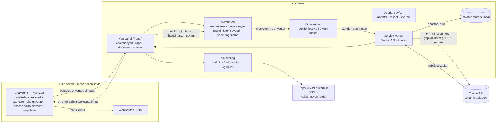

# UX Doktor

Açık web sayfasını analiz eden, UX eksikliklerini tespit edip skorlayan ve her bulguyu kanıtla gösteren Chrome
eklentisi (Manifest V3). İki katmanlıdır:

- **Deterministik katman:** axe-core ile WCAG 2.2 AA kontrolleri (kontrast, alt metin, form etiketi, 24×24 px
  dokunma hedefi, sayfa dili ve diğer AA ihlalleri).
- **Yorumsal katman:** Claude API ile Don Norman'ın 6 ilkesine göre evet/hayır rubriği. LLM puan vermez; her cevap
  için kanıt öğe kimlikleri ve gerekçe döndürür, puanı kod hesaplar.

Kanıtı olmayan bulgu, bulgu sayılmaz: her bulgu benzersiz bir CSS seçiciye bağlıdır, sayfada vurgulanabilir ve
isteğe bağlı olarak kırpılmış ekran görüntüsüyle gösterilir.

Ödev metni: [docs/ODEV.md](docs/ODEV.md) · Gereksinim izlenebilirliği: [docs/GEREKSINIMLER.md](docs/GEREKSINIMLER.md)

---

## İçindekiler

1. [Kurulum](#kurulum)
2. [Kullanım](#kullanım)
3. [Mimari](#mimari)
4. [İzinler ve gerekçeleri](#izinler-ve-gerekçeleri)
5. [Deterministik katman](#deterministik-katman)
6. [Yorumsal (LLM) katman](#yorumsal-llm-katman)
7. [Gizlilik ve güvenlik](#gizlilik-ve-güvenlik)
8. [Skor formülü ve gerekçesi](#skor-formülü-ve-gerekçesi)
9. [Rapor biçimi](#rapor-biçimi)
10. [Doğrulama (Ödev Bölüm 4)](#doğrulama-ödev-bölüm-4)
11. [Bilinen sınırlamalar](#bilinen-sınırlamalar)
12. [Geliştirme](#geliştirme)
13. [Teslim kontrol listesi](#teslim-kontrol-listesi)

---

## Kurulum

Gereksinimler: Node.js **22.12 veya üstü** (Vitest 5 ve Vite 8 bu sürümü ister), Chrome **114 veya üstü**
(`chrome.sidePanel`), bir Claude API anahtarı.

```bash
npm install
npm run build        # tsc -b + vite build → dist/ (ayrıca release/ altında zip)
```

Chrome'a yükleme:

1. `chrome://extensions` adresini açın, sağ üstten **Geliştirici modu**nu açın.
2. **Paketlenmemiş öğe yükle** → projenin `dist/` klasörünü seçin.
3. Araç çubuğundaki yapboz simgesinden **UX Doktor**'u sabitleyin.
4. Simgeye tıklayın: yan panel açılır. Panelde **Ayarlar** düğmesine basın.
5. Ayarlar sayfasında Claude API anahtarınızı girin, **Kaydet** ve **Anahtarı doğrula** deyin. Model seçin
   (varsayılan: `claude-opus-5-5`).

Anahtar yalnızca bu tarayıcıda `chrome.storage.local` içinde tutulur; hiçbir dosyaya yazılmaz, senkronize edilmez,
loglanmaz.

## Kullanım

1. Analiz etmek istediğiniz **herkese açık** sayfayı açın ve araç çubuğundaki UX Doktor simgesine **o sekmedeyken**
   tıklayın (bu, eklentiye yalnızca o sekme için geçici erişim verir).
2. **Bu sayfayı analiz et**: deterministik analiz ve hassas sayfa tespiti çalışır; skorlar ve bulgular görünür.
3. Bulgularda **Sayfada göster** ile öğe vurgulanır; **Kanıt görüntüsü al** ile kırpılmış ekran görüntüsü bulguya
   eklenir.
4. **LLM analizi için gönderimi hazırla**: maskelenmiş öğe envanteri çıkarılır ve gönderilecek JSON'un tamamı onay
   ekranında gösterilir. **Gönder** demeden istek atılmaz.
5. **Raporu JSON olarak indir**: rapor tarayıcının indirme klasörüne iner (`reports/` klasörüne kopyalayın).
6. **Doğrulama araçları**: aynı sayfayı N kez analiz (N ≥ 3) ve halüsinasyon elle doğrulama listesi.

Simgeye tıklamadan panel zaten açıksa ve sayfaya erişim izni yoksa panel bunu söyler. İki seçenek vardır:
o sekmedeyken simgeye yeniden tıklamak ya da paneldeki **Site erişim izni ver** düğmesiyle isteğe bağlı izni vermek.
Verdiğiniz izni Ayarlar sayfasından geri alabilirsiniz.

---

## Mimari



| Klasör | İçerik |
|---|---|
| `src/background` | Service worker: yan panel davranışı, anahtar doğrulama, Claude API çağrısı (`llmCall.ts`) |
| `src/content` | Enjekte edilen analiz betiği: axe-core çalıştırma, seçici üretimi, envanter, hassas sayfa sinyalleri, vurgulama |
| `src/sidepanel` | Yan panel arayüzü, sekme köprüsü, LLM istemcisi, ekran görüntüsü, dışa aktarma |
| `src/options` | Ayarlar sayfası |
| `src/shared` | Rapor şeması (tek kaynak: `report.ts`), maskeleme, hassas sayfa tespiti, rubrik, istek gövdesi, yanıt doğrulama |
| `src/scoring` | Skor formülü (`score.ts`), ağırlıklar (`weights.ts`), tutarlılık istatistikleri (`stats.ts`) |
| `docs/` | Ödev metni, gereksinim tablosu, doğrulama şablonları |
| `reports/` | Gerçek çalıştırmaların JSON raporları |
| `scripts/` | Dışa aktarımlardan tablo ve oran üreten yardımcı betikler |

Analiz betiği manifest'te statik `content_scripts` olarak tanımlı değildir; yalnızca kullanıcı analiz başlattığında
`chrome.scripting.executeScript` ile enjekte edilir. CRXJS `?iife` importuyla tek parça derlenir ve
`web_accessible_resources` listesinden çıkarılır (`vite.config.ts`), böylece web sayfaları eklentinin varlığını bu
dosya üzerinden tespit edemez.

---

## İzinler ve gerekçeleri

| İzin | Neden gerekli | Kurulumda uyarı |
|---|---|---|
| `sidePanel` | Arayüz Chrome yan panelinde; simge tıklaması paneli açar (`setPanelBehavior`). | Hayır |
| `storage` | API anahtarı ve model seçimi `chrome.storage.local` içinde. | Hayır |
| `activeTab` | Yalnızca kullanıcının simgeye tıkladığı sekmeye geçici erişim; sayfadan ayrılınca düşer. Ekran görüntüsü (`captureVisibleTab`) de bu izinle çalışır. | Hayır |
| `scripting` | Analiz betiğini yalnızca analiz istendiğinde enjekte etmek (`executeScript`). | Hayır |
| `host_permissions: https://api.anthropic.com/*` | Service worker'ın Claude API isteklerinin CORS nedeniyle engellenmemesi; yalnızca API alan adı. | Evet (yalnızca bu alan) |
| `optional_host_permissions: http://*/*, https://*/*` | **Kurulumda istenmez.** activeTab yetmezse (ör. panel açıkken başka sekmeye geçildiyse) kullanıcı paneldeki düğmeyle açıkça verir; Ayarlar'dan geri alınır. | İstendiği anda |

Bilerek kullanılmayanlar: statik `content_scripts`, `tabs`, `debugger`, `downloads` (indirme `<a download>` ile),
`contentSettings`.

Kaynaklar: [sidePanel](https://developer.chrome.com/docs/extensions/reference/api/sidePanel),
[activeTab](https://developer.chrome.com/docs/extensions/develop/concepts/activeTab),
[scripting](https://developer.chrome.com/docs/extensions/reference/api/scripting),
[captureVisibleTab](https://developer.chrome.com/docs/extensions/reference/api/tabs#method-captureVisibleTab),
[permissions](https://developer.chrome.com/docs/extensions/reference/api/permissions).

---

## Deterministik katman

axe-core 4.13.0, paketten gömülü olarak (uzak kod yok) `runOnly` etiketleri `wcag2a, wcag2aa, wcag21a, wcag21aa,
wcag22aa` ile çalışır. Kural adları paketteki `axe.getRules()` çıktısından doğrulanmıştır.

| Kategori | axe kuralları | WCAG |
|---|---|---|
| Renk kontrastı | `color-contrast` | 1.4.3 |
| Metin alternatifi | `image-alt`, `input-image-alt`, `role-img-alt`, `svg-img-alt`, `area-alt`, `object-alt` | 1.1.1 (area: 2.4.4, 4.1.2) |
| Form alanı etiketleri | `label`, `select-name`, `aria-input-field-name`, `aria-toggle-field-name` | 4.1.2 |
| Dokunma hedefi (24×24 px) | `target-size` — axe'de **varsayılan kapalıdır**, açıkça etkinleştirilir | 2.5.8 |
| Sayfa dili | `html-has-lang`, `html-lang-valid`, `valid-lang`, `html-xml-lang-mismatch` | 3.1.1, 3.1.2 |
| Diğer WCAG 2.2 AA ihlalleri | Etiket kümesindeki diğer tüm kurallar | kurala göre |

- Şiddet, axe'in `impact` değerinden eşlenir: critical → Kritik, serious → Yüksek, moderate → Orta, minor → Düşük.
- axe'in `incomplete` sonuçları ihlal sayılmaz ve skora girmez; **"Elle incelenmeli"** başlığıyla ayrı listelenir.
- Her bulgunun seçicisi `querySelectorAll` ile tekilliği doğrulanmış bir CSS seçicidir. Shadow DOM ve iframe
  içindeki öğeler bilgi amaçlı listelenir ama vurgulanamaz.
- Düzeltme önerileri Türkçedir. Kontrastta ölçülen renkler ve oran öneriye yazılır.

## Yorumsal (LLM) katman

**Girdi: numaralı öğe envanteri.** Sayfadaki landmark'lar, başlıklar, durum/canlı bölgeler, görünür etkileşimli
öğeler ve imleci "pointer" olan ama etkileşimli olmayan öğeler `E1, E2, …` kimlikleriyle listelenir. Her öğede şunlar
bulunur: rol, erişilebilir ad ya da görünür metin (maskelenmiş), etiket türü (`nameSource`), boyut ve konum,
görünürlük, ilk ekranda olup olmadığı, yazı boyutu, disabled/required/aria-* durumları, bağlantı hedef türü, temel
stiller ve benzersiz seçici. Sayfa özeti de eklenir: sayaçlar ile okunabilen stil dosyalarındaki `:focus`,
`:focus-visible` ve `:hover` kural sayıları. Envanter en çok **200 öğe** içerir; kesilirse rapora ve panele yazılır.
Ekran görüntüsü LLM'e gönderilmez.

**Rubrik:** 6 ilke × 4-5 soru = 29 evet/hayır sorusu (`src/shared/rubric.ts`). Her soru "evet = ilkeye uygun"
biçimindedir. "Hayır" cevabının şiddeti rubrikte sabittir; LLM belirlemez.

| İlke | Soru sayısı | Örnek |
|---|---|---|
| Görünürlük | 5 | Birincil eylem ilk ekranda görünür bir düğme/bağlantı mı? |
| Geri Bildirim | 5 | Durum mesajları için canlı bölge (aria-live/status/alert) var mı? |
| Kısıtlar | 4 | Giriş alanları uygun `type` ile sınırlandırılmış mı? |
| Eşleme | 5 | Form etiketleri alanla programatik olarak eşleşmiş mi? |
| Tutarlılık | 5 | Aynı işlevdeki öğeler tutarlı görünüm kullanıyor mu? |
| Sağlarlık | 5 | Tıklanabilir öğeler doğru öğe/rolle mi işaretlenmiş? |

**Çıktı:** her soru için `{questionId, answer: evet|hayir|belirsiz, evidenceIds, rationale, fix}`. Yanıt,
`output_config.format` ile JSON şemasına zorlanır ve istemcide yeniden doğrulanır.

**Tutarlılığı artıran ayarlar** (Claude API dokümantasyonuna göre):

| Model | Ayar |
|---|---|
| `claude-opus-5-5` (varsayılan) | `effort: "medium"` sabit. Bu model `temperature` kabul etmez (400 döner); düşünme her zaman açıktır. |
| `claude-sonnet-5-5` | `effort: "medium"` sabit; varsayılan dışı `temperature` 400 döner. |
| `claude-haiku-4-5` | `temperature: 0`; `effort` desteklenmez. |

Bunlara ek olarak:
- Rubrik ve prompt sabittir ve sürümlüdür (`PROMPT_VERSION`, her çalıştırmaya yazılır).
- Tutarlılık testinde envanter bir kez çıkarılır ve aynı gövde N kez gönderilir.
- `cache_control` ile tekrarlanan girdi önbellekten okunur; bu yalnızca maliyeti etkiler, çıktıyı etkilemez.

**Ret yedeği:** Opus/Sonnet 5.5'te `fallbacks: "default"` (beta başlığı `server-side-fallback-2026-07-01`) gönderilir.
Model isteği güvenlik nedeniyle reddederse API isteği önerilen başka bir modelde çalıştırır. Hangi modelin yanıtladığı
(`servedModel`, `fallbackUsed`) her çalıştırma kaydına yazılır. Bu, tutarlılık ölçümünde model değişimini görünür
kılar.

**Halüsinasyon kontrolü (otomatik):**
1. **Kimlik kontrolü:** envanterde olmayan bir kimliğe yapılan her atıf halüsinasyon sayılır, kanıttan düşülür ve
   sayılır. Geçerli kanıtı kalmayan "hayır" bulgu üretmez, skorda "belirsiz" sayılır. Sayfa düzeyindeki yokluklar
   (ör. hiç canlı bölge yok) için yalnızca `SAYFA` kimliği geçerlidir.
2. **Seçici kontrolü:** bulgu seçicileri sayfada yeniden aranır ve tek öğeyle eşleşip eşleşmediği raporlanır.

**Service worker çağrısı:** API çağrısı resmi `@anthropic-ai/sdk` ile service worker'dan yapılır.
- **Tarayıcı başlığı:** `dangerouslyAllowBrowser: true` seçeneği tarayıcıdan doğrudan erişim için gereken
  `anthropic-dangerous-direct-browser-access: true` başlığını ekler.
- **Otomatik tekrar kapalı:** `maxRetries: 0`; kullanıcının onayladığından fazla istek gitmez.
- **Uyanık tutma:** yan panel port üzerinden 20 saniyede bir ping atar; uzun süren istek sırasında service worker
  uykuya geçmez.

---

## Gizlilik ve güvenlik

- **Hassas sayfa tespiti** (`src/shared/sensitivity.ts`, birim testli). Sinyaller:
  - şifre alanı,
  - `autocomplete="cc-*"`, `one-time-code`, `current-password`, `new-password`,
  - hesap/oturum metinleri ("Hesabım", "Çıkış Yap", "Profilim", "Randevularım", …),
  - giriş/hesap/ödeme URL kalıpları ve kimlik doğrulamalı hizmetler (giris.turkiye.gov.tr, e-Nabız, MHRS).

  Tespit edilirse LLM gönderimi **kilitlenir**. Kullanıcı açık onay kutusunu işaretlerse açılır; onay ve zamanı
  rapora (`privacy`) yazılır.
- **Gönderim onayı:** her LLM gönderiminden önce onay ekranı açılır. Gönderilecek gövdenin tamamı gösterilir ve
  gönderilen gövdeyle birebir aynıdır (uçtan uca testte doğrulandı). Tutarlılık testinde onay ekranı N'yi açıkça yazar.
- **Maskeleme** (`src/shared/masking.ts`, birim testli): TC kimlik no (11 hane), telefon (TR ve uluslararası),
  e-posta, IBAN, kart numarası. Envanterdeki tüm metinler ve rapordaki HTML kanıt parçaları maskelenir.
- **Form değerleri okunmaz:** `input/textarea/select` öğelerinin `.value` değeri okunmaz; `value` attribute'u ve
  textarea/contenteditable içeriği alınmaz. `value` ile adlandırılmış düğmeler `nameSource:
  "value-attribute-hidden"` olarak işaretlenir. Rapordaki HTML parçalarında `value="[gizlendi]"` yazılır.
- **Salt okunur analiz:** tıklama, form gönderme, klavye simülasyonu yok; `chrome.debugger` kullanılmaz.
- **Vurgulama katmanı:** shadow DOM içinde, `pointer-events: none`; temizlenince tamamen kaldırılır. Analiz ve
  envanter öncesinde otomatik temizlenir, böylece sonucu etkilemez.
- **Uzak kod yok:** CDN betiği, `eval` ve uzaktan import kullanılmaz; axe-core paketten gömülüdür.
- **API anahtarı:** koda gömülü değildir, repoya girmez, loglanmaz, panele gönderilmez. Service worker her çağrıda
  storage'dan okur.

---

## Skor formülü ve gerekçesi

Tüm ağırlıklar tek dosyadadır: [`src/scoring/weights.ts`](src/scoring/weights.ts). Formül:
[`src/scoring/score.ts`](src/scoring/score.ts) (birim testli). Sürüm: `skor-v1`.

**Şiddet ağırlıkları:** w(Kritik) = 4, w(Yüksek) = 3, w(Orta) = 2, w(Düşük) = 1.

**1. Deterministik kategori skoru** (her kategori c için):

```
S_c = 100 × P_c / (P_c + Σ_i w(şiddet_i))
```

P_c: kategorideki kuralları geçen öğe sayısı (axe `passes`). Toplam, kategorideki her ihlalli öğenin şiddet
ağırlığı üzerinden alınır. Kategoride hiç öğe yoksa skor **uygulanamaz** (null) olur ve toplamdan çıkar.
Örnek: kontrastı geçen 9 öğe ve 1 Yüksek ihlal → 100 × 9 / (9 + 3) = 75.

*Gerekçe:* İhlal sayısını tek başına saymak büyük sayfaları cezalandırır. Bu oran, ihlalleri sayfanın büyüklüğüne
göre değerlendirir. Ağırlık sayesinde kritik bir ihlal, düşük bir ihlalden dört kat fazla düşürür. axe'in
`incomplete` sonuçları kesin olmadığı için skora girmez.

**2. Norman ilke skoru** (her ilke p için, LLM cevaplarından **kod** hesaplar):

```
S_p = 100 × Σ w(evet) / (Σ w(evet) + Σ w(hayır))
```

w: sorunun rubrikteki şiddet ağırlığı. "Belirsiz" cevaplar skora girmez. Kanıtı geçersiz olduğu için belirsize
düşen "hayır"lar da girmez. İlkede hiç evet/hayır yoksa skor uygulanamaz olur.

*Gerekçe:* LLM'e puan verdirmek tekrarlanabilir değildir. Evet/hayır cevapları ve sabit şiddet ağırlıkları
kullanılınca skor denetlenebilir hale gelir: her puan farkı belirli bir sorunun cevabına kadar izlenebilir.
Statik analizle karar verilemeyen durumlar "belirsiz" olarak skoru yapay şekilde düşürmez.

**3. Katman skorları:** alt skorların ağırlıklı ortalaması. Uygulanamayan alt skorlar çıkarılır, kalan ağırlıklar
yeniden ölçeklenir.

| Deterministik kategori | Ağırlık | | Norman ilkesi | Ağırlık |
|---|---|---|---|---|
| Renk kontrastı | 0,25 | | Görünürlük | 1/6 |
| Metin alternatifi | 0,20 | | Geri Bildirim | 1/6 |
| Form alanı etiketleri | 0,20 | | Kısıtlar | 1/6 |
| Dokunma hedefi | 0,10 | | Eşleme | 1/6 |
| Sayfa dili | 0,10 | | Tutarlılık | 1/6 |
| Diğer WCAG AA | 0,15 | | Sağlarlık | 1/6 |

*Gerekçe:* Kontrast, alt metin ve form etiketleri hem en sık görülen hem de içeriğe erişimi doğrudan engelleyen
sorunlardır. Dil ve dokunma hedefi daha dar etkilidir. Diğer AA ihlalleri bir arada orta ağırlık alır. Ödevde Norman
ilkeleri arasında öncelik tanımlanmadığı için ilkeler eşit ağırlıklıdır.

**4. Toplam skor:**

```
Toplam = 0,6 × Deterministik + 0,4 × LLM        (LLM analizi yoksa Toplam = Deterministik)
```

*Gerekçe:* Deterministik ölçüm kesin ve tekrarlanabilirdir. LLM yorumu ise çalıştırmalar arasında değişebilir
(bkz. tutarlılık testi). Bu yüzden toplamda deterministik katman daha ağır basar. Deterministik ve LLM skorları
panelde ve raporda **ayrı** gösterilir.

---

## Rapor biçimi

Şemanın tek kaynağı [`src/shared/report.ts`](src/shared/report.ts) dosyasıdır (`schemaVersion: 1.0.0`). Raporun ana
alanları:

| Alan | İçerik |
|---|---|
| `page` | Sayfanın kökeni + yolu (sorgu dizesi alınmaz), başlık, dil |
| `privacy` | Hassas sayfa sonucu, gerekçeler, açık onay ve zamanı |
| `deterministic` | axe sürümü, etiketler, bulgular, elle incelenmeli listesi, kategori başına geçen öğe sayıları |
| `llm` | Çalıştırma kaydı (ham yanıt, prompt sürümü, istenen/yanıtlayan model, parametreler, zaman, token), envanter kesilme bilgisi, rubrik cevapları, bulgular, halüsinasyon istatistikleri |
| `scores` | Deterministik ve LLM katman skorları (alt skorlar ve hesap ayrıntısıyla), toplam, ağırlıklar, formül sürümü |
| `llmRequestPreview` | LLM'e gönderilen istek gövdesi (onay ekranındakiyle aynı; anahtar içermez) |

Her bulgu (`Finding`) şu alanları içerir:
- `selector`; LLM bulgularında ek olarak `elementId`,
- `source` (`deterministic` | `llm`),
- `rule` ("WCAG 1.4.3" ya da "Norman: Geri Bildirim"),
- `severity` (Kritik / Yüksek / Orta / Düşük),
- `description` ve `fix`,
- `evidence`: vurgulanabilirlik, maskelenmiş HTML ve isteğe bağlı ekran görüntüsü.

---

## Doğrulama (Ödev Bölüm 4)

> Bu bölümdeki **tüm değerler öğrencinin gerçek çalıştırmalarından** gelir. Araç verileri üretir (dışa aktarımlar ve
> `scripts/`), ancak sonuçları ve yorumları öğrenci yazar. Doldurulmamış alanlar `TODO: gerçek ölçüm` olarak
> bırakılmıştır.

### Test edilen siteler

| Kategori | Site ve sayfa (herkese açık) | Rapor | Deterministik | LLM | Toplam |
|---|---|---|---|---|---|
| Sağlık | TODO: gerçek ölçüm | `reports/saglik-…json` | TODO: gerçek ölçüm | TODO: gerçek ölçüm | TODO: gerçek ölçüm |
| Türk e-ticaret | TODO: gerçek ölçüm | `reports/eticaret-…json` | TODO: gerçek ölçüm | TODO: gerçek ölçüm | TODO: gerçek ölçüm |
| Kamu hizmeti | TODO: gerçek ölçüm | `reports/kamu-…json` | TODO: gerçek ölçüm | TODO: gerçek ölçüm | TODO: gerçek ölçüm |

### a) Tutarlılık testi

Yöntem:
- Yan panelde **Aynı sayfayı N kez analiz et** (N ≥ 3).
- Envanter bir kez çıkarılır, aynı istek gövdesi N kez gönderilir.
- Dışa aktarılan `reports/tutarlilik-<site>.json` dosyasından tablo `node scripts/tutarlilik-tablosu.mjs` ile üretilir.

| Alan | Değer |
|---|---|
| Sayfa | TODO: gerçek ölçüm |
| Model / prompt sürümü / N | TODO: gerçek ölçüm |
| İlke başına ortalama, std, min-max | TODO: gerçek ölçüm (betiğin ürettiği tabloyu buraya yapıştırın) |
| En büyük sapma (max − min) | TODO: gerçek ölçüm |
| Sapma 10 puanı aştı mı? | TODO: gerçek ölçüm |
| Aştıysa neden (cevabı değişen sorular: dışa aktarımdaki `questionAgreement`) | TODO: gerçek ölçüm |
| Çözüm ve çözüm sonrası ölçüm | TODO: gerçek ölçüm |

### b) Manuel karşılaştırma

Klavye ve ekran okuyucuyla en az bir görev: [docs/manuel-karsilastirma.md](docs/manuel-karsilastirma.md).

| Yakalanan | Kaçırılan | Yanlış alarm |
|---|---|---|
| TODO: gerçek ölçüm | TODO: gerçek ölçüm | TODO: gerçek ölçüm |

### c) Halüsinasyon kontrolü

Kontrol iki aşamalıdır:
1. **Otomatik:** kimlik envanterde mi, seçici sayfada mı. Sonuçlar raporun `llm.hallucination` alanındadır.
2. **Elle:** **Elle doğrulama listesini JSON olarak indir** ile her LLM bulgusu boş `gercekMi` alanıyla dışa
   aktarılır. Doldurduktan sonra oranı `node scripts/halusinasyon-orani.mjs reports/halusinasyon-*.json` hesaplar.

| Ölçü | Değer |
|---|---|
| Toplam LLM atfı / envanterde olmayan atıf (otomatik) | TODO: gerçek ölçüm |
| Elle doğrulanan bulgu sayısı | TODO: gerçek ölçüm |
| Var olmayan / yanlış öğeye işaret eden bulgu oranı | TODO: gerçek ölçüm |

### d) Büyükanne Testi ve Gece 3 Acil Durum Testi

Şablonlar: [docs/buyukanne-testi.md](docs/buyukanne-testi.md),
[docs/gece-3-acil-durum-testi.md](docs/gece-3-acil-durum-testi.md).

| Test | Aracın yakaladığı kritik sorun | Aracın kaçırdığı kritik sorun |
|---|---|---|
| Büyükanne Testi | TODO: gerçek ölçüm | TODO: gerçek ölçüm |
| Gece 3 Acil Durum Testi | TODO: gerçek ölçüm | TODO: gerçek ölçüm |

---

## Bilinen sınırlamalar

- **Statik analiz:** Sayfayla etkileşim yapılmaz (tıklama, yazma, odaklama yok). Bu yüzden **Geri Bildirim** ilkesi
  yalnızca statik ipuçlarından değerlendirilir:
  - aria-live/status/alert bölgeleri,
  - aria-invalid, aria-describedby,
  - yükleme göstergesi sayaçları,
  - okunabilen stil dosyalarındaki `:focus`, `:focus-visible` ve `:hover` kuralları.

  Gerçek hata mesajları, yükleme davranışı ve hover/focus görünümü doğrulanmaz. İpucu yoksa cevap "belirsiz" olur ve
  skora girmez.
- **Başka kökenden yüklenen stil dosyaları** (CDN) CORS nedeniyle okunamaz; odak/hover kural sayıları eksik kalabilir.
  Sayfa özetinde `unreadableSheets` olarak raporlanır.
- **iframe ve shadow DOM:** axe `iframes: false` ile çalışır. Shadow DOM içindeki öğeler envantere girmez. axe
  bulgularında listelenirler ama vurgulanamazlar.
- **Envanter sınırı:** en çok 200 öğe; çok büyük sayfalarda kesilir (rapora yazılır). LLM yalnızca gördüğü öğeler
  hakkında karar verir.
- **Dinamik sayfalar:** Analizden sonra DOM değişirse seçiciler eşleşmeyebilir. Seçici kontrolü bunu raporlar.
- **LLM değişkenliği:** Opus 5.5 ve Sonnet 5.5 `temperature` kabul etmez. Tutarlılık için effort sabitlenir ve rubrik
  kapalı uçludur, ancak çalıştırmalar arası fark tamamen sıfırlanamaz. Bu fark tutarlılık testiyle ölçülür.
  Sunucu taraflı yedek model devreye girerse (ret durumunda) yanıtı başka bir model üretir; kayıtta görünür.
- **Maskeleme kurallı (regex) çalışır:**
  - Kişi adları ve serbest metindeki sağlık bilgisi maskelenmez.
  - Şüpheli uzun sayılar (13-19 hane) kart olarak maskelenebilir; bu bilinçli olarak fazla maskelemedir.
- **Hassas sayfa tespiti sezgiseldir.** Oturum metni olmayan kişisel sayfalar kaçabilir; herkese açık bir sayfadaki
  "Hesabım" bağlantısı yanlış alarm verebilir (kullanıcı onayıyla açılır).
- **Ekran görüntüsü** `activeTab` (ya da `<all_urls>`) ister. İsteğe bağlı http/https izni bunun yerine geçmez; bu
  durumda vurgulama kullanılabilir.
- **activeTab ve yan panel:** Resmi doküman, simgeye tıklanınca açılan yan panelin activeTab verip vermediğini
  belirtmiyor. Verilmezse panel bunu söyler ve isteğe bağlı site izni sunar.
- **Kural ağırlıkları** (kategori ve katman ağırlıkları) uzman yargısıdır; ampirik olarak kalibre edilmemiştir.

---

## Geliştirme

```bash
npm run build       # tip kontrolü + derleme (dist/)
npm run typecheck   # yalnızca tip kontrolü (tsc -b)
npm test            # Vitest birim testleri
npm run dev         # CRXJS geliştirme sunucusu (HMR)
```

Birim testleri: maskeleme, hassas sayfa tespiti, axe eşlemesi, LLM istek gövdesi ve yanıt doğrulama, skor formülü,
tutarlılık istatistikleri, rapor ve dışa aktarım kurucuları (`src/**/*.test.ts`). Testlerde gerçek API anahtarı ve
gerçek kişisel veri kullanılmaz.

Commit öncesi: `npm run build`, `npx tsc --noEmit -p tsconfig.app.json` ve `npm test` hatasız geçmelidir. Kök
`tsconfig.json` yalnızca referans içerdiği için kökte `npx tsc --noEmit` hiçbir dosyayı denetlemez; bu yüzden `-p`
ile alt yapılandırma ya da `npm run typecheck` kullanın.

## Teslim kontrol listesi

| Teslim | Durum |
|---|---|
| GitHub repo (anlamlı commit geçmişi) | https://github.com/HakanKoco/UX-DOCTOR-CHROME (push: Claude) |
| README: kurulum, skor formülü, mimari şema, bilinen sınırlamalar | Bu dosya |
| README: doğrulama sonuçları | TODO: gerçek ölçüm (öğrenci) |
| 3 sitenin JSON raporu (`reports/`) | TODO: gerçek ölçüm (öğrenci) |
| 3-5 dakikalık demo videosu | TODO (öğrenci) — bağlantı: |
| Yansıtma notu (yarım sayfa) | TODO (öğrenci) |
